# IZ Clinical Notes Analyzer

Current app version: `2.0.0-beta.3` / build `2026.09.03.1` on the `beta-local-desktop-v2` channel.

Version 2.0 Beta is the active local desktop runtime. The pre-2.0 implementation is preserved under `deprecated/v1/` for historical reference, migration traceability, and regression comparison.

IZ Clinical Notes Analyzer is a local-first clinical chart-review and Treatment Plan Timeliness Tracker app for Windows 10/11 desktop use. It helps R3 staff check clinical-note binders and treatment-plan tracking evidence before office-manager approval. The current app runs as one local FastAPI desktop service with a React/Vite browser interface at `http://localhost:8000`, SQLite under the user's local app-data folder, encrypted local uploaded-file storage, encrypted API configuration storage, role-based access control, deterministic treatment-plan rules, workflow profiles, readiness checks, optional LLM configuration disabled by default, and forensic audit logging.

The normal R3 Windows user path does not require Windows administrator access, Docker, PostgreSQL, cloud hosting, Git, Node.js, command-line work, or a database administrator when a prepared release folder with built frontend assets is used.

Marleigh's illustrated, non-technical setup/install/daily-use/troubleshooting guide is [Marleigh-Setup-Install-and-User-Guide.html](<docs/guides/Version 2.0 Beta  2.0.0-beta.2  beta-local-desktop-v2/Marleigh-Setup-Install-and-User-Guide.html>). It is the primary clinical-manager handoff for Version 2.0 Beta and includes synthetic, non-PHI screenshots from the real local startup and V2 UI.

## Current Version 2.0 Beta State

Version 2.0 Beta is the current local Windows desktop beta. It includes:

- A focused V2 FastAPI runtime in `backend/app/` with active V2 routes in `backend/app/v2/api/routes.py`.
- A focused V2 React/Vite UI in `frontend/src/v2/` led by Status Dashboard, an MRN-centered Patient Roster, Manual Upload, Treatment Plan Detail, an Alleva Treatment Plans Roster, API Testing Harness, Users, Forensic Logs, Settings, and Help.
- Treatment Plan Checklist Version 1 as the canonical source in `config\checklists\treatment-plan-v1.json`; its checklist content version remains separate from the app version.
- An MRN-first treatment-plan workflow: each Patient Roster row offers every locally stored plan in descending last-updated order, both rosters open an exact plan in Treatment Plan Detail, and the full nested clinical-content viewer retains checklist evidence, manager actions, Evidence Coverage Map, and bounded Raw Field Explorer.
- A V2 API Testing Harness with `ClientId`, Pull ALL Treatment Plans job lifecycle, compact progress, cancel, redacted JSONL/TSV/schema artifacts, and bounded preview.
- Local-first audit/version/readiness services, safe forensic log summaries, encrypted/local app-data boundaries, and frontend footer version metadata.
- Windows preflight, local-stack smoke, API-configuration smoke, release-folder packaging, required-file validation, and forbidden-file scans for a prepared release folder.
- V2 documentation under `docs\v2-beta\`, including validation evidence and task coverage audit.
Version 2.0 Beta still does not include startup-triggered Alleva import or a signed MSI/MSIX. Operator-triggered treatment-plan sync remains off by default and requires a client ID, encrypted secret, explicit API/sync enablement, and live read-only tenant authorization. The published Alleva v1 mapping is applied automatically and versioned internally; no separate mapping-approval form is required. The level-of-care-change treatment-plan update window remains unvalidated by R3/Marleigh and must stay configurable and visibly marked as unresolved.

`2.0.0-beta.3` is a prerelease office-manager workflow and release-readiness update, not a production declaration. Before a production release, R3 must complete supervised approved live Alleva validation; rotate the exposed credential and approve downstream/history remediation; and record signing and retention/legal-hold decisions. The current validation status is recorded in `docs/validation/office-manager-production-fixes-2026-09-03.md`; the historical beta.2 procedure remains in `docs/v2-beta/release-readiness-2026-07-11.md`.

## Interactive Architecture Diagram

GitHub renders this Mermaid diagram directly in the README. In GitHub views that support Mermaid click targets, select a node to open the relevant file or folder. If click targets are unavailable in a viewer, use the `Key Files` section below.

```mermaid
flowchart TB
    Staff["R3 staff<br/>Admin / Office manager / Counselor"]

    subgraph Windows["Windows 10/11 local desktop runtime"]
        Launcher["Double-click launcher<br/>scripts/Start-IZ-Clinical-Notes-Analyzer.cmd"]
        Preflight["Preflight and setup<br/>scripts/preflight-windows.ps1"]
        Desktop["FastAPI desktop runtime<br/>backend/app/desktop_main.py<br/>localhost:8000"]
        StaticUI["Built React assets<br/>frontend/dist"]
    end

    subgraph Browser["Browser UI served from localhost:8000"]
        ReactApp["React app<br/>frontend/src/App.tsx"]
        Views["Main screens<br/>Dashboard, Patient Roster, Manual Upload,<br/>Treatment Plan Detail, Treatment Plans Roster,<br/>API Testing Harness, Users, Logs, Settings, Help"]
        DetailUI["Treatment detail and evidence UI<br/>frontend/src/v2/components/TreatmentPlanDetailViewer.tsx"]
        JobUI["Large job progress UI<br/>frontend/src/v2/components/JobProgressCard.tsx"]
        Styles["Responsive styles and status colors<br/>frontend/src/app.css"]
    end

    subgraph Backend["FastAPI backend services"]
        MainAPI["Main API and app factory<br/>backend/app/main.py"]
        Routes["Active V2 routes<br/>backend/app/v2/api/routes.py"]
        Domain["Treatment-plan contracts<br/>backend/app/v2/domain/schemas.py"]
        SampleData["Test-only synthetic fixture<br/>backend/app/v2/services/sample_data.py"]
        Jobs["Large API jobs and artifacts<br/>backend/app/v2/services/jobs.py<br/>backend/app/v2/services/job_artifacts.py"]
        DashboardData["Dashboard data<br/>backend/app/v2/services/dashboard_data.py"]
        Audit["Forensic audit logging<br/>backend/app/services/audit.py"]
        Version["Version and readiness<br/>backend/app/services/version.py<br/>backend/app/v2/api/routes.py"]
    end

    subgraph Config["Repo configuration and product rules"]
        Checklist["Canonical 42-step checklist<br/>config/checklists/treatment-plan-v1.json"]
        RuleYaml["Treatment Plan Tracking rules<br/>config/rules/alleva_treatment_plan_completeness_rules.yaml"]
        VersionFiles["Version metadata<br/>VERSION and VERSION.json"]
    end

    subgraph LocalData["Local app data outside the repo<br/>%LOCALAPPDATA%/IZ Clinical Notes Analyzer"]
        Env[".env<br/>local settings and generated access values"]
        SQLite["SQLite database<br/>clinical-notes-analyzer.sqlite3"]
        EncryptedUploads["Encrypted uploads<br/>clinical source files"]
        Logs["Startup logs and fallback audit logs"]
        Reports["Redacted API reports"]
    end

    subgraph External["External systems and optional integrations"]
        Alleva["Alleva REST / OpenAPI / HL7<br/>testing plus authorized read-only treatment-plan import"]
        LLM["Optional OpenAI-compatible LLM<br/>disabled by default"]
    end

    subgraph Packaging["Packaging and legacy boundary"]
        Builder["Release-folder builder<br/>scripts/build-windows-installer.ps1"]
        Release["Prepared release folder<br/>dist/windows-release/IZ-Clinical-Notes-Analyzer-v2.0.0-beta.3"]
        Legacy["Archived V1 runtime<br/>deprecated/v1"]
    end

    Staff --> Launcher --> Preflight --> Desktop
    Desktop --> StaticUI --> ReactApp
    Staff --> ReactApp
    ReactApp --> Views
    ReactApp --> DetailUI
    ReactApp --> JobUI
    ReactApp --> Styles
    ReactApp --> MainAPI
    Desktop --> MainAPI
    MainAPI --> Routes
    Routes --> Domain
    Routes --> Jobs
    Routes --> DashboardData
    Routes --> Audit
    Routes --> Version
    Domain --> RuleYaml
    Routes --> Checklist
    Version --> VersionFiles
    MainAPI --> SQLite
    MainAPI --> Env
    Audit --> Logs
    Jobs --> Reports
    Jobs -. explicit tenant-authorized read-only import .-> Alleva
    MainAPI -. optional and disabled by default .-> LLM
    Builder --> Release
    Legacy -. not ordinary Windows runtime .-> Windows

    click Launcher "scripts/Start-IZ-Clinical-Notes-Analyzer.cmd" "Open Windows launcher"
    click Preflight "scripts/preflight-windows.ps1" "Open Windows preflight"
    click Desktop "backend/app/desktop_main.py" "Open desktop runtime"
    click ReactApp "frontend/src/App.tsx" "Open React app"
    click DetailUI "frontend/src/v2/components/TreatmentPlanDetailViewer.tsx" "Open treatment detail UI"
    click JobUI "frontend/src/v2/components/JobProgressCard.tsx" "Open large job UI"
    click Styles "frontend/src/app.css" "Open app styles"
    click MainAPI "backend/app/main.py" "Open main FastAPI app"
    click Routes "backend/app/v2/api/routes.py" "Open active V2 routes"
    click Domain "backend/app/v2/domain/schemas.py" "Open V2 contracts"
    click SampleData "backend/app/v2/services/sample_data.py" "Open test-only synthetic fixture"
    click Jobs "backend/app/v2/services/jobs.py" "Open large job service"
    click DashboardData "backend/app/v2/services/dashboard_data.py" "Open dashboard data"
    click Audit "backend/app/services/audit.py" "Open audit service"
    click Checklist "config/checklists/treatment-plan-v1.json" "Open canonical checklist"
    click RuleYaml "config/rules/alleva_treatment_plan_completeness_rules.yaml" "Open deterministic rules"
    click VersionFiles "VERSION.json" "Open version metadata"
    click Builder "scripts/build-windows-installer.ps1" "Open release builder"
    click Legacy "deprecated/v1/README.md" "Open V1 archive notes"
```



Diagram boundaries:

- The normal runtime is one local FastAPI desktop service at `http://localhost:8000` serving the React UI and API.
- Runtime data lives under `%LOCALAPPDATA%\IZ Clinical Notes Analyzer`, not inside the source checkout.
- Synthetic fixtures are not imported by active V2 routes or production pages; the default queue remains empty until persisted evidence is imported.
- Alleva REST/OpenAPI paths include readiness tests and an operator-triggered read-only treatment-plan import. Import remains off by default and requires encrypted credentials, API/sync enablement, and explicit tenant authorization; patient-name import remains separately disabled by default.
- Optional LLM configuration exists but is disabled by default and is not the primary review path.
- Docker/PostgreSQL artifacts are not ordinary Windows desktop requirements.

## Primary Docs

- `docs\guides\Version 2.0 Beta  2.0.0-beta.2  beta-local-desktop-v2\Marleigh-Setup-Install-and-User-Guide.html`
- `docs\release-notes.md`
- `docs\beta-client-test-run-guide.md`
- `docs\Windows-User-Guide-Version-1.md`
- `docs\Windows-Deployment-and-Test-Guide-Version-1.md`
- `docs\UAT-Version-1-Marleigh.md`
- `docs\patient-treatment-plan-handling.md`
- `docs\treatment-plan-checklist-v1.md`
- `docs\open-blockers.md`
- `docs\validation\validation-report-2026-06-16-production-readiness.md`
- `docs\api-configuration-and-connectivity.md`
- `docs\architecture.md`
- `docs\runbook.md`
- `docs\codebase-map.md`
- `docs\admin-access-reset.md`

Historical validation reports keep the original version they validated. Use `docs\release-notes.md`, `VERSION`, and `VERSION.json` for the current release number.

## Quick Start for a Prepared Windows Release Folder

A release folder is created by double-clicking `Build-IZ-Windows-Installer.cmd` from the repo root. The detailed build/install guide is `docs\windows-installer-build-and-install.md`. For the current Version 2.0 Beta (`2.0.0-beta.3`), it writes:

- `dist\windows-release\IZ-Clinical-Notes-Analyzer-v2.0.0-beta.3`
- `dist\windows-release\IZ-Clinical-Notes-Analyzer-v2.0.0-beta.3.zip`

The `2.0.0-beta.1` and beta.2 output names recorded in earlier validation reports are historical evidence, not current beta.3 installation instructions.

To install from a prepared release folder:

1. Open `dist\windows-release\IZ-Clinical-Notes-Analyzer-v2.0.0-beta.3`.
2. Double-click `Install-IZ-Clinical-Notes-Analyzer.cmd`.
3. Wait for preflight to finish.
4. Launch from the Start Menu shortcut named `IZ Clinical Notes Analyzer`.

The per-user install path is `%LOCALAPPDATA%\Programs\IZ Clinical Notes Analyzer`. Local runtime data is preserved under `%LOCALAPPDATA%\IZ Clinical Notes Analyzer` when the normal uninstall removes app files.

The prepared release folder also includes double-click commands for diagnostics, backup, data-preserving uninstall, and complete uninstall:

- `Stop-IZ-Clinical-Notes-Analyzer.cmd`
- `Collect-IZ-Clinical-Notes-Analyzer-Diagnostics.cmd`
- `Backup-IZ-Clinical-Notes-Analyzer.cmd`
- `Uninstall-IZ-Clinical-Notes-Analyzer.cmd`
- `Complete-Uninstall-IZ-Clinical-Notes-Analyzer.cmd`

Complete uninstall requires typing `REMOVE IZ DATA` and removes the local runtime data folder for the current Windows user. Create a backup first unless R3 intentionally wants the laptop cleared.

## Quick Start for a Source Checkout

Use this path for development, validation, or support work. It is not the preferred non-technical production path.

Requirements:

- Windows 10 or Windows 11.
- Python 3.11 or newer.
- Internet access the first time Python packages are installed.
- Node.js LTS only when the browser UI must be rebuilt because `frontend\dist` is missing or stale.

Use a normal local folder such as:

```text
C:\Users\<your-user>\local-apps\IZ_clinical-notes-analyzer
```

Avoid running the source checkout directly from OneDrive, Dropbox, iCloud Drive, Google Drive, or a network share.

Double-click:

```text
scripts\Start-IZ-Clinical-Notes-Analyzer.cmd
```

The launcher calls `scripts\startup-windows-local.ps1`, which runs preflight, creates local AppData folders and `.env` when missing, checks Python and backend packages, validates rules/checklists, detects missing or stale frontend assets, prompts before installing or rebuilding when needed, starts the local FastAPI desktop app, and opens the browser unless `-NoBrowser` is used.

If Windows says the app is already running, the local port is in use, or a previous console did not close cleanly, double-click:

```text
scripts\Stop-IZ-Clinical-Notes-Analyzer.cmd
```

The cleanup launcher stops only app-specific local launcher/server processes, shows what it is doing in the console, and asks `Do you want to restart the app?`. It does not close browser windows or clear patient data.

The app should open automatically. If it does not, browse to:

```text
http://localhost:8000
```

## Useful Local Pages

| Page | Address |
| --- | --- |
| App home | `http://localhost:8000` |
| Manual upload | `http://localhost:8000/?view=uploads` |
| API configuration | `http://localhost:8000/api-configuration` |
| API health | `http://localhost:8000/api/health` |
| Readiness | `http://localhost:8000/api/readiness` |
| Version | `http://localhost:8000/api/version` |
| API docs | `http://localhost:8000/docs` |

## Supported Upload Files

Supported extensions: `.csv`, `.doc`, `.docx`, `.jpeg`, `.jpg`, `.pdf`, `.png`, `.rtf`, `.txt`, and `.zip`.

Upload limits:

| Limit | Value |
| --- | --- |
| Maximum one file | `50MB` |
| Maximum total binder upload | `250MB` |
| Maximum files in one binder upload | `40` |

## Local Data Locations

The Windows desktop runtime stores data outside the repo:

```text
%LOCALAPPDATA%\IZ Clinical Notes Analyzer
```

Important local files and folders:

| Path | Purpose |
| --- | --- |
| `%LOCALAPPDATA%\IZ Clinical Notes Analyzer\.env` | Local configuration and generated local access material |
| `%LOCALAPPDATA%\IZ Clinical Notes Analyzer\clinical-notes-analyzer.sqlite3` | Local SQLite application database |
| `%LOCALAPPDATA%\IZ Clinical Notes Analyzer\uploads` | Encrypted uploaded clinical files |
| `%LOCALAPPDATA%\IZ Clinical Notes Analyzer\logs` | Startup logs and fallback audit logs |
| `%LOCALAPPDATA%\IZ Clinical Notes Analyzer\api-reports` | Redacted app API harness reports |
| `%LOCALAPPDATA%\IZ Clinical Notes Analyzer\api-connectivity-reports` | Reports from `scripts\test-alleva-api-connectivity.ps1` |
| `%USERPROFILE%\Documents\IZ Clinical Notes Analyzer Backups` | Backup zips created by the backup helper |

The local configuration, database, and uploads must be backed up together. If the local configuration is lost, encrypted uploads and saved API configuration may not be recoverable.

Use `Backup-IZ-Clinical-Notes-Analyzer.cmd` or the Start Menu backup shortcut to create a full local-data backup zip. The backup is not redacted because it is intended for restore; store it encrypted and access-controlled.

## API Configuration and Alleva Readiness

Admins can open `http://localhost:8000/api-configuration` from App settings or directly. When opened from the app, the page reuses the current admin session and does not require a second in-page admin login. App settings is the source of truth for the one active Alleva/API connection; the harness loads and tests those same active values.

The app API harness can:

- save vendor/base URL settings
- use a one-time API key for a test when a vendor uses API-key auth
- save API keys and client secrets in encrypted form
- use OAuth2 client credentials to request a bearer token for a test
- save the OpenAPI URL used by readiness checks and operation tests
- choose body, Basic, URL-encoded Basic, try-both, or try-all token auth styles
- pull OpenAPI/Swagger definitions from a Swagger UI page or direct JSON URL
- test selected OpenAPI operations with generated path/query/header/body fields
- show bounded, redacted, non-secret results

Alleva confirmed that it does not currently support FHIR; the active app does not ask for or require a FHIR endpoint.

For Alleva OAuth, pasting the client ID and client secret supplied by R3/Alleva is expected. The client secret is write-only after save: the browser only receives configured/not-configured flags, and stored secrets are encrypted in the local SQLite database.

Stored API endpoint profiles are optional presets for alternate Alleva or future vendor connection values. Activating a profile copies its REST API base URL, OpenAPI URL, token URL, token auth style, client ID, and encrypted client secret into the active App settings connection. Only the active connection is used by readiness checks, the API harness, periodic checks, and operator-triggered REST treatment-plan sync.

Periodic API readiness checks are readiness checks only. They authenticate and test configuration; they do not import live patient charts or treatment plans.

### Standalone Alleva Scripts

Two standalone scripts exist and have different safety profiles:

| Script | Purpose | Secret behavior |
| --- | --- | --- |
| `scripts\test-alleva-api-connectivity.ps1` | Simple Swagger/OpenAPI/API reachability probe and JSON report writer. | Designed for redacted reports; still review output before sharing. |
| `Test-AllevaApi.ps1` | Full diagnostic tester with interactive endpoint selection, local settings, and detailed request/response capture. | Sensitive by default: it prints/saves tokens, secrets, Authorization headers, request bodies, and response bodies unless `-RedactSensitive` is used. |

Keep `.alleva.local.ps1`, generated logs, tokens, secrets, and any real API output out of Git, tickets, screenshots, chat, and email unless an approved secure workflow says otherwise. Do not use real PHI in API tests.

Current 2026-06-17 validation evidence: the public Swagger UI at `https://api.allevasoft.com/swagger/index.html` and OpenAPI definitions at `/swagger/v1/swagger.json` and `/swagger/v2/swagger.json` are reachable. The OpenAPI definitions describe Alleva REST API operations. `https://api.allevasoft.com/advanced-form-elements` is a protected REST operation path and returned `401 Unauthorized` without credentials.

Version `2.0.0-beta.3` removes active FHIR/SMART-on-FHIR configuration, discovery, import-plan, scopes, UI fields, defaults, and validation requirements from Alleva workflows. The V2 REST sync path uses the saved Alleva API base URL, token URL, client ID, encrypted client secret, token auth style, and automatic canonical Alleva v1 mapping. It uses `/clients.mrn` as the canonical local patient key, retains `/clients.id` only as the Alleva relationship key, pulls the complete bounded global treatment-plan collection across all patient lifecycle states, and fetches bounded plan detail/diagnosis evidence for every attributable plan. Treatment-review evidence remains unknown unless a trusted review-to-plan identifier exists. Alleva does not perform the compliance decision; R3's deterministic local rules run after normalization. Operator-triggered sync is disabled by default and requires API/sync enablement plus explicit live read-only tenant authorization.

## Treatment Plan Tracking Rules

The Version 2.0 Beta `Treatment Plans Roster`, `Patient Roster` and `Treatment Plan Detail` screens provide the work queue and evidence review. Beta3 implements source-scoped rosters/export, exact saved-plan selection, immutable review/correction lineage, explicit metric units, readable checklist evidence and manager actions. Deterministic Missing Data, Needs Review, Conflicting Evidence and Unable to Evaluate outcomes remain distinct; live Alleva sync stays gated. See [final smoke results](docs/validation/office-manager-final-smoke-2026-09-04.md) for actual backend, frontend, packaged-browser and native-interaction evidence and limits.

The current implementation reference is `docs\patient-treatment-plan-handling.md`. It maps the manual-upload path, gated Alleva REST sync, patient-level aggregate, local treatment-plan tables, deterministic timeliness evaluator, 42-step selected-client checklist output, content-fact privacy boundary, and exact backend/frontend code locations.

For the first client beta run, use the illustrated Marleigh guide under `docs\guides\Version 2.0 Beta  2.0.0-beta.2  beta-local-desktop-v2` as the primary non-technical install, launch, treatment-plan audit, troubleshooting, diagnostics, backup, and maintenance handoff. The guide directory name is historical and intentionally unchanged. Use `docs\beta-client-test-run-guide.md` as the shorter day-of-test checklist.

### Supported explicit manual metadata

Synthetic or approved manual TXT/CSV/TSV/binder inputs may provide `patient_name` or `patient_full_name`, optional plan-local `service_date` or `serviceDate`, optional `original_plan_reference`, and the existing explicit `signature_date` or `signature_datetime` fields. Combined completion/signature prose is intentionally not parsed. Omitted name, reference, or service date remains omitted; omission never erases an existing encrypted name snapshot. Conflicting values produce `Conflicting Evidence` and safe field-name-only warnings instead of a guessed winner. The optional name, service-date, and reference fields do not populate admission date, date-clock anchors, signature dates, patient identity, or source identity. Authorized patient names are encrypted UI display values only; they are never matching keys or CSV, audit, log, or query fields. Parser, storage, route and UI behavior have regression coverage; consult the final smoke report for the actual tested surfaces.

### Office-manager roster and export boundary

The Patient Roster and Treatment Plans Roster use exact `patient_record_id`, source system, source record/plan ID and immutable `plan_version_id` identity. The default is the latest plan for each exact patient-row/source/external-plan identity; historical selection is explicit. All/source-filtered requests return their matching current rows. Name/reference searches are local UI filters: requests send every filtered result ID, including off-screen rows, and POST CSV export includes the complete filtered set. Export keeps immutable machine IDs and safe status/date fields, excluding names, original references, search text, narrative and credentials. Empty explicit selections produce a header-only export; unauthorized or mismatched IDs fail atomically. Counts distinguish patient records, plans, criteria and correction items. These software contracts do not authorize live vendor import or establish clinical compliance.

The date clock compares the laptop/facility-local current date against either the admission date or the latest valid treatment-plan review/update date. PHP treatment plans use a 30-calendar-day update interval. Other configured treatment levels use a 60-calendar-day update interval. A level-of-care change has a separate manager-editable preset of 7 calendar days, but that LOC-change setting remains visibly marked unvalidated until R3/Marleigh confirms the exact rule.

If an uploaded or API-style pulled plan has no permitted patient name, the app creates a safe fallback display name:

- no name found in source evidence: `no-name-found_YYYY-MM-DD_HHMMSS`

Alleva REST treatment-plan sync stores that redacted fallback by default even when `/clients` contains a name. Admins must turn on `Import and display Alleva patient names` in App settings before imported names are stored or shown. Turning the setting off redacts existing Alleva-sourced treatment-plan client display names again.
- empty or unusable value found: `no-value-found_YYYY-MM-DD_HHMMSS`

Deterministic rules live in:

```text
config\rules\alleva_treatment_plan_completeness_rules.yaml
```

## Workflow Profiles

Admins and office managers can manage versioned workflow profiles from the `Workflow profiles` screen. The Workflow profiles screen includes a `Seed draft from 42-step checklist` action. It loads `config\checklists\treatment-plan-v1.json`, copies the 42 steps, review statuses, override requirements, source modes, audit events, and export fields into a draft workflow snapshot, and gives admins/managers a starting point they can edit before publishing a new workflow version.

Published or archived workflow history must be archived instead of hard-deleted so historical metrics can be interpreted correctly.

## Validation Commands

Backend tests:

```powershell
$env:PYTHONPATH = "$PWD\backend"
.\backend\.venv\Scripts\python.exe -m pytest .\backend\tests -q
```

Frontend tests and build:

```powershell
cd frontend
npm test -- --run
npm run build
cd ..
```

Windows preflight and local smoke:

```powershell
.\scripts\preflight-windows.ps1 -AssumeYes
.\scripts\test-local-app-stack.ps1
.\scripts\test-api-configuration-local.ps1
```

## Legacy Docker/PostgreSQL Status

Docker/PostgreSQL is not the active ordinary Windows desktop path, and the current branch does not have an active root `docker-compose.yml` full-stack deployment file. Do not present Docker, PostgreSQL, nginx, Git, Node.js, or command-line work as ordinary R3 desktop-user requirements. Do not restore the old Docker stack to active paths unless R3 explicitly reintroduces Docker/server deployment and updates the README, Windows docs, CI, tests, and release instructions together.

## Key Files

| File | Purpose |
| --- | --- |
| `VERSION` and `VERSION.json` | Version metadata shown by `/api/version` and the UI footer |
| `frontend\package.json` | Frontend package version metadata |
| `docs\release-notes.md` | Current release notes and version history |
| `docs\beta-client-test-run-guide.md` | Non-technical first beta client test-run guide |
| `scripts\Start-IZ-Clinical-Notes-Analyzer.cmd` | Double-click Windows launcher |
| `scripts\Stop-IZ-Clinical-Notes-Analyzer.cmd` | Double-click Windows cleanup and restart prompt |
| `scripts\Backup-IZ-Clinical-Notes-Analyzer.cmd` | Double-click local-data backup helper |
| `scripts\Complete-Uninstall-IZ-Clinical-Notes-Analyzer.cmd` | Double-click complete uninstall helper for app files plus local data |
| `scripts\startup-windows-local.ps1` | Main Windows local startup script |
| `scripts\stop-windows-local.ps1` | App-specific Windows process cleanup script |
| `scripts\backup-local-data.ps1` | Backup zip creator for the local AppData folder |
| `scripts\complete-uninstall-local-data.ps1` | Confirmed complete uninstall for installed app and local data |
| `scripts\preflight-windows.ps1` | Windows runtime/readiness preflight |
| `scripts\build-windows-installer.ps1` | Release-folder and zip builder |
| `scripts\update-local-admin.ps1` | Local authorized admin reset utility |
| `backend\app\desktop_main.py` | Desktop FastAPI entrypoint |
| `backend\app\main.py` | Main FastAPI app factory and API endpoints |
| `backend\app\services\secure_storage.py` | Encrypted file and configuration helpers |
| `backend\app\services\patient_notes.py` | Patient-note upload storage and detection helpers |
| `backend\app\services\timeliness.py` | Treatment Plan Timeliness service |
| `backend\app\services\alleva_treatment_plan_sync.py` | Gated Alleva REST treatment-plan sync and current-plan content capture |
| `backend\app\services\alleva_treatment_plan_aggregate.py` | Patient treatment-plan aggregate dry-run builder |
| `backend\app\api\timeliness_routes.py` | Treatment Plan Timeliness dashboard/detail/aggregate/override routes |
| `backend\app\services\rules_engine.py` | Deterministic YAML rules engine |
| `backend\app\api\api_config_routes.py` | API configuration JSON routes |
| `backend\app\api\workflow_routes.py` | Workflow profile CRUD/versioning routes |
| `frontend\src` | React frontend source |
| `frontend\dist` | Built frontend assets after `npm run build` |
| `config\rules\alleva_treatment_plan_completeness_rules.yaml` | Treatment Plan Tracking completeness rules |
| `config\checklists\treatment-plan-v1.json` | Canonical 42-step checklist |
| `docs\patient-treatment-plan-handling.md` | Current treatment-plan handling and code-location reference |
| `docs\sample-clinical-notes` | Synthetic, non-PHI sample clinical notes |

## Version Metadata

The current app version is:

```text
2.0.0-beta.3
```

Checklist content version is separate and remains:

```text
1.2.0
```

Version metadata is stored in `VERSION` and `VERSION.json`. The backend exposes it at:

```text
GET /api/version
```

The UI footer displays the backend-provided beta label, version, environment, and short git commit when available.
