# IZ Clinical Notes Analyzer

Current app version: `1.4.2` / build `2026.06.18.2`.

IZ Clinical Notes Analyzer is a local-first clinical chart-review app for Windows 10/11 desktop use. It helps R3 staff check clinical-note binders and Treatment Plan Tracking evidence before office-manager approval. The current app runs as one local FastAPI desktop service with a React/Vite browser interface at `http://localhost:8000`, SQLite under the user's local app-data folder, encrypted local uploaded-file and API-secret storage, role-based access control, deterministic Treatment Plan Tracking rules, workflow profiles, readiness checks, API configuration/testing, optional LLM configuration disabled by default, and forensic audit logging.

The normal R3 Windows user path does not require Docker, PostgreSQL, cloud hosting, Git, Node.js, or a database administrator when a prepared release folder with built frontend assets is used.

## Current Version 1.4.2 State

Version 1.4.2 is the current local-desktop patch. It includes:

- Treatment Plan Checklist Version 1 as the canonical source in `config\checklists\treatment-plan-v1.json`.
- A user-visible Checklist tab with acronym definitions, review statuses, the LOC-change blocker, and all 42 PRD checklist steps.
- Dashboard review-source choices for EMR/API readiness and manual upload.
- Manual upload, uploaded-binder deletion, automated review, reviewer notes, manager disposition, and CSV/JSON exports.
- Manual upload delete controls show confirmation guidance when clicked early and no longer present disabled buttons with a Windows busy cursor.
- Treatment Plan Timeliness dashboard/detail views, manual overrides, evidence comparison, task-list copy/export, and CSV/JSON exports.
- Admin/manager Workflow profiles with draft, publish, archive, unused-draft delete, and `Seed draft from 42-step checklist` actions.
- Role-scoped User management: admins can manage all roles; office managers can manage counselor accounts only; counselors manage only their own account.
- In-app Help with role permissions, screen guides, button behavior, setup notes, workflow guidance, API/EMR definitions, and LLM configuration notes.
- Stored EMR endpoint profiles for Alleva now and future EMR/FHIR endpoints, with encrypted client-secret storage and one-click activation for readiness/API tests.
- Admin-only App settings, API/EMR setup, LLM setup, and Forensic logs.
- Deployment-readiness hardening for redacted PDF metadata extraction, generated placeholder display names, timezone-aware audit display, stale-session handling, button-event audit logging, safe periodic source checks, bounded API operation responses, and API client-credentials testing.
- Windows preflight, setup/start wrappers, release-folder packaging scripts, and install/launch/uninstall commands for a prepared release folder.

Version 1.4.2 still does not include ungated live Alleva patient import or a signed MSI/MSIX. The Alleva REST treatment-plan sync path is present but disabled by default until R3/Alleva live-sync approval and endpoint mapping validation are complete. The level-of-care-change treatment-plan update window remains unvalidated by R3/Marleigh and must stay configurable and visibly marked as unresolved.

## Interactive Architecture Diagram

GitHub renders this Mermaid diagram directly in the README. In GitHub views that support Mermaid click targets, select a node to open the relevant file or folder. If click targets are unavailable in a viewer, use the `Key Files` section below.

```mermaid
flowchart TB
    Staff["R3 staff<br/>Admin / Office manager / Counselor"]

    subgraph Windows["Windows 10/11 local desktop runtime"]
        Launcher["Double-click launcher<br/>scripts/Start-IZ-Clinical-Notes-Analyzer.cmd"]
        Preflight["Preflight and setup<br/>scripts/preflight-windows.ps1"]
        Desktop["FastAPI desktop runtime<br/>backend/app/desktop_main.py<br/>localhost:8000"]
        StaticUI["Built React assets<br/>frontend/dist"]
    end

    subgraph Browser["Browser UI served from localhost:8000"]
        ReactApp["React app<br/>frontend/src/App.tsx"]
        Views["Main screens<br/>Dashboard, Treatment plans, Uploads,<br/>Review queue, Checklist, Help,<br/>Users, Workflow profiles, Settings, Logs"]
        Feedback["Dialogs and progress UI<br/>frontend/src/components/feedback.tsx"]
        Styles["Responsive styles and status colors<br/>frontend/src/app.css"]
    end

    subgraph Backend["FastAPI backend services"]
        MainAPI["Main API and app factory<br/>backend/app/main.py"]
        Auth["Auth, password reset, RBAC<br/>backend/app/api/auth_user_routes.py"]
        Routes["Primary authenticated routes<br/>backend/app/api/routes.py"]
        Uploads["Patient-note binder service<br/>backend/app/services/patient_notes.py"]
        Timeliness["Treatment Plan Timeliness<br/>backend/app/services/timeliness.py"]
        Rules["Deterministic rules engine<br/>backend/app/services/rules_engine.py"]
        Workflow["Workflow profile versioning<br/>backend/app/api/workflow_routes.py"]
        APIHarness["API/EMR readiness harness<br/>backend/app/api/api_config_routes.py"]
        Audit["Forensic audit logging<br/>backend/app/services/audit.py"]
        Version["Version and readiness<br/>backend/app/services/version.py<br/>backend/app/services/runtime_checks.py"]
    end

    subgraph Config["Repo configuration and product rules"]
        Checklist["Canonical 42-step checklist<br/>config/checklists/treatment-plan-v1.json"]
        RuleYaml["Treatment Plan Tracking rules<br/>config/rules/alleva_treatment_plan_completeness_rules.yaml"]
        VersionFiles["Version metadata<br/>VERSION and VERSION.json"]
    end

    subgraph LocalData["Local app data outside the repo<br/>%LOCALAPPDATA%/IZ Clinical Notes Analyzer"]
        Env[".env<br/>local secrets and bootstrap admin value"]
        SQLite["SQLite database<br/>clinical-notes-analyzer.sqlite3"]
        EncryptedUploads["Encrypted uploads<br/>clinical source files"]
        Logs["Startup logs and fallback audit logs"]
        Reports["Redacted API reports"]
    end

    subgraph External["External systems and optional integrations"]
        Alleva["Alleva / future EMR / FHIR<br/>readiness and operation tests only"]
        LLM["Optional OpenAI-compatible LLM<br/>disabled by default"]
    end

    subgraph Packaging["Packaging and legacy boundary"]
        Builder["Release-folder builder<br/>scripts/build-windows-installer.ps1"]
        Release["Prepared release folder<br/>dist/windows-release/IZ-Clinical-Notes-Analyzer-v1.4.2"]
        Legacy["Deprecated Docker/PostgreSQL artifacts<br/>depriceated/ and legacy startup stubs"]
    end

    Staff --> Launcher --> Preflight --> Desktop
    Desktop --> StaticUI --> ReactApp
    Staff --> ReactApp
    ReactApp --> Views
    ReactApp --> Feedback
    ReactApp --> Styles
    ReactApp --> MainAPI
    Desktop --> MainAPI
    MainAPI --> Auth
    MainAPI --> Routes
    Routes --> Uploads
    Routes --> Timeliness
    Routes --> Workflow
    Routes --> APIHarness
    Routes --> Audit
    Routes --> Version
    Timeliness --> Rules
    Rules --> RuleYaml
    Routes --> Checklist
    Version --> VersionFiles
    Uploads --> EncryptedUploads
    MainAPI --> SQLite
    MainAPI --> Env
    Audit --> Logs
    APIHarness --> Reports
    APIHarness -. readiness only, no live patient import .-> Alleva
    MainAPI -. optional and disabled by default .-> LLM
    Builder --> Release
    Legacy -. not ordinary Windows runtime .-> Windows

    click Launcher "scripts/Start-IZ-Clinical-Notes-Analyzer.cmd" "Open Windows launcher"
    click Preflight "scripts/preflight-windows.ps1" "Open Windows preflight"
    click Desktop "backend/app/desktop_main.py" "Open desktop runtime"
    click ReactApp "frontend/src/App.tsx" "Open React app"
    click Feedback "frontend/src/components/feedback.tsx" "Open feedback components"
    click Styles "frontend/src/app.css" "Open app styles"
    click MainAPI "backend/app/main.py" "Open main FastAPI app"
    click Auth "backend/app/api/auth_user_routes.py" "Open auth and user routes"
    click Routes "backend/app/api/routes.py" "Open primary routes"
    click Uploads "backend/app/services/patient_notes.py" "Open patient-note service"
    click Timeliness "backend/app/services/timeliness.py" "Open timeliness service"
    click Rules "backend/app/services/rules_engine.py" "Open rules engine"
    click Workflow "backend/app/api/workflow_routes.py" "Open workflow routes"
    click APIHarness "backend/app/api/api_config_routes.py" "Open API configuration routes"
    click Audit "backend/app/services/audit.py" "Open audit service"
    click Checklist "config/checklists/treatment-plan-v1.json" "Open canonical checklist"
    click RuleYaml "config/rules/alleva_treatment_plan_completeness_rules.yaml" "Open deterministic rules"
    click VersionFiles "VERSION.json" "Open version metadata"
    click Builder "scripts/build-windows-installer.ps1" "Open release builder"
    click Legacy "depriceated/DEPRECATED-MANIFEST.md" "Open deprecated manifest"
```



Diagram boundaries:

- The normal runtime is one local FastAPI desktop service at `http://localhost:8000` serving the React UI and API.
- Runtime data lives under `%LOCALAPPDATA%\IZ Clinical Notes Analyzer`, not inside the source checkout.
- Alleva/FHIR/API paths are readiness and operation-test paths only; live patient import remains disabled.
- Optional LLM configuration exists but is disabled by default and is not the primary review path.
- Docker/PostgreSQL artifacts are legacy references, not ordinary Windows desktop requirements.

## Primary Docs

- `docs\Windows-User-Guide-Version-1.md`
- `docs\Windows-Deployment-and-Test-Guide-Version-1.md`
- `docs\UAT-Version-1-Marleigh.md`
- `docs\treatment-plan-checklist-v1.md`
- `docs\open-blockers.md`
- `docs\validation\validation-report-2026-06-16-production-readiness.md`
- `docs\api-configuration-and-connectivity.md`
- `docs\architecture.md`
- `docs\runbook.md`
- `docs\codebase-map.md`

## Plain-English Workflow

Use the app to:

1. Upload an exported clinical-note or treatment-plan binder.
2. Let deterministic rules check the binder against configured Treatment Plan Tracking completeness and timeliness logic.
3. Review missing, incomplete, conflicting, manually confirmed, or not-applicable items.
4. Route the chart to an office manager.
5. Approve the chart or return it to the counselor with comments.
6. Record treatment-plan overrides when authorized.
7. Keep a local audit trail of sign-ins, uploads, reviews, settings changes, workflow changes, and API tests.
8. Test future Alleva/API connectivity without pretending live patient import is ready.
9. Delete an uploaded/analyzed local binder when it should no longer remain in the app.

Important boundaries:

- Uploaded files are encrypted before local storage.
- Runtime data is stored under the user's local app-data folder, not inside the source-code folder.
- Saved API keys and client secrets are encrypted and are not returned to the browser.
- Optional LLM support is disabled by default; deterministic rules remain the primary review path.
- Live Alleva patient import is disabled until R3/Alleva supplies official tenant credentials, endpoint mapping, scopes, pagination/rate limits, attachment behavior, vendor documentation, and compliance approval.
- Do not use real PHI in development, testing, screenshots, documentation, Git commits, or API connectivity probes unless the deployment has been approved for production PHI handling.

## Roles

| Role | Current capabilities |
| --- | --- |
| Counselor | Uploads/updates binders, reviews assigned or returned work, views permitted treatment-plan details, exports permitted work lists, and manages their own account. |
| Office manager | Reviews charts, confirms checklist items, approves or returns charts, records treatment-plan overrides, manages counselor users, and manages Workflow profiles. |
| Admin | Manages every screen and action, including all users, App settings, readiness checks, forensic logs, API/EMR setup, LLM setup, Workflow profiles, and local configuration. |

## Quick Start for a Prepared Windows Release Folder

A release folder is created by `scripts\build-windows-installer.ps1`. For Version 1.4.2 it writes:

- `dist\windows-release\IZ-Clinical-Notes-Analyzer-v1.4.2`
- `dist\windows-release\IZ-Clinical-Notes-Analyzer-v1.4.2.zip`

To install from a prepared release folder:

1. Open `dist\windows-release\IZ-Clinical-Notes-Analyzer-v1.4.2`.
2. Double-click `Install-IZ-Clinical-Notes-Analyzer.cmd`.
3. Wait for preflight to finish.
4. Launch from the Start Menu shortcut named `IZ Clinical Notes Analyzer`.

The per-user install path is `%LOCALAPPDATA%\Programs\IZ Clinical Notes Analyzer`. Local runtime data is preserved under `%LOCALAPPDATA%\IZ Clinical Notes Analyzer` when the app files are uninstalled.

## Quick Start for a Source Checkout

Use this path for development, validation, or support work. It is not the preferred non-technical production path.

### Requirements

- Windows 10 or Windows 11.
- Python 3.11 or newer.
- Internet access the first time Python packages are installed.
- Node.js LTS only when the browser UI must be rebuilt because `frontend\dist` is missing or stale.

### Launch

Use a normal local folder such as:

```text
C:\Users\<your-user>\local-apps\IZ_clinical-notes-analyzer
```

Avoid running the source checkout directly from OneDrive, Dropbox, iCloud Drive, Google Drive, or a network share.

Double-click:

```text
scripts\Start-IZ-Clinical-Notes-Analyzer.cmd
```

The launcher calls `scripts\startup-windows-local.ps1`, which runs preflight, creates local AppData folders and `.env` when missing, checks Python and backend packages, validates rules/checklists, detects missing or stale frontend assets, prompts before installing or rebuilding when needed, starts the local FastAPI desktop app, and opens the browser unless `-NoBrowser` is used.

If packages are missing, type `Y` when prompted. Automated support runs can use:

```powershell
powershell.exe -NoProfile -ExecutionPolicy Bypass -File .\scripts\startup-windows-local.ps1 -AssumeYes
```

The app should open automatically. If it does not, browse to:

```text
http://localhost:8000
```

## First Admin Sign-In

On first launch, the startup window prints first sign-in credentials similar to:

```text
Username: admin
Password: <generated-password>
```

Save that value securely. The generated local configuration lives here:

```text
%LOCALAPPDATA%\IZ Clinical Notes Analyzer\.env
```

That file contains secrets and encryption keys. Treat it like a password vault item. If no admin can sign in later, use `docs\admin-access-reset.md`.

## Useful Local Pages

| Page | Address |
| --- | --- |
| App home | `http://localhost:8000` |
| Manual upload | `http://localhost:8000/?view=uploads` |
| Clinical notes intake guide | `http://localhost:8000/clinical-notes-intake` |
| API configuration | `http://localhost:8000/api-configuration` |
| API health | `http://localhost:8000/api/health` |
| Readiness | `http://localhost:8000/api/readiness` |
| Version | `http://localhost:8000/api/version` |
| API docs | `http://localhost:8000/docs` |

## Supported Upload Files

Supported extensions:

- `.csv`
- `.doc`
- `.docx`
- `.jpeg`
- `.jpg`
- `.pdf`
- `.png`
- `.rtf`
- `.txt`
- `.zip`

Upload limits:

| Limit | Value |
| --- | --- |
| Maximum one file | `50MB` |
| Maximum total binder upload | `250MB` |
| Maximum files in one binder upload | `40` |

Notes:

- `.doc` files are stored securely, but text extraction is more reliable from `.docx`, `.pdf`, `.txt`, `.csv`, and readable text exports.
- Patient ID auto-detection scans filenames and readable file contents.
- If multiple conflicting patient IDs are detected, verify the binder before submitting.
- Downloads are decrypted only after authentication and authorization checks pass.

## Local Data Locations

The Windows desktop runtime stores data outside the repo:

```text
%LOCALAPPDATA%\IZ Clinical Notes Analyzer
```

Important local files and folders:

| Path | Purpose |
| --- | --- |
| `%LOCALAPPDATA%\IZ Clinical Notes Analyzer\.env` | Local configuration, generated secrets, bootstrap admin password, encryption key |
| `%LOCALAPPDATA%\IZ Clinical Notes Analyzer\clinical-notes-analyzer.sqlite3` | Local SQLite application database |
| `%LOCALAPPDATA%\IZ Clinical Notes Analyzer\uploads` | Encrypted uploaded clinical files |
| `%LOCALAPPDATA%\IZ Clinical Notes Analyzer\logs` | Startup logs and fallback audit logs |
| `%LOCALAPPDATA%\IZ Clinical Notes Analyzer\api-reports` | Redacted app API harness reports |
| `%LOCALAPPDATA%\IZ Clinical Notes Analyzer\api-connectivity-reports` | Reports from `scripts\test-alleva-api-connectivity.ps1` |

The `.env`, database, and uploads must be backed up together. If the `.env` file is lost, encrypted uploads and saved API secrets may not be recoverable.

## API Configuration and Alleva Readiness

Admins can open `http://localhost:8000/api-configuration` from App settings or directly. When opened from the app, the page reuses the current admin session and does not require a second in-page admin login.

The app API harness can:

- save vendor/base URL settings
- use a one-time API key for a test
- save API keys and client secrets in encrypted form
- use OAuth2 client credentials to request a bearer token for a test
- choose body, Basic, URL-encoded Basic, try-both, or try-all token auth styles
- pull OpenAPI/Swagger definitions from a Swagger UI page or direct JSON URL
- test selected OpenAPI operations with generated path/query/header/body fields
- show bounded, redacted, non-secret results

For FHIR tests, the FHIR base URL means the root FHIR R4 endpoint supplied by Alleva or a future EMR vendor, for example an endpoint ending in `/fhir/R4`.

Periodic API readiness checks are readiness checks only. They authenticate and test configuration; they do not import live patient charts or treatment plans.

### Standalone Alleva Scripts

Two standalone scripts exist and have different safety profiles:

| Script | Purpose | Secret behavior |
| --- | --- | --- |
| `scripts\test-alleva-api-connectivity.ps1` | Simple Swagger/OpenAPI/API reachability probe and JSON report writer. | Designed for redacted reports; still review output before sharing. |
| `Test-AllevaApi.ps1` | Full diagnostic tester with interactive endpoint selection, local settings, and detailed request/response capture. | Sensitive by default: it prints/saves tokens, secrets, Authorization headers, request bodies, and response bodies unless `-RedactSensitive` is used. |

Keep `.alleva.local.ps1`, generated logs, tokens, secrets, and any real API output out of Git, tickets, screenshots, chat, and email unless an approved secure workflow says otherwise. Do not use real PHI in API tests.

Current 2026-06-17 validation evidence: the public Swagger UI at `https://api.allevasoft.com/swagger/index.html` and OpenAPI definitions at `/swagger/v1/swagger.json` and `/swagger/v2/swagger.json` are reachable. The OpenAPI definitions describe Alleva REST API operations; they are not FHIR R4 base URLs. `https://api.allevasoft.com/advanced-form-elements` is a protected REST operation path and returned `401 Unauthorized` without credentials. The App settings `FHIR base URL` field should stay blank until Alleva/R3 supplies a tenant root FHIR R4 endpoint, such as an endpoint ending in `/fhir/R4`.

Version `1.4.2` separates the Alleva REST sync settings from the FHIR readiness fields. The REST sync path uses the Alleva API base URL (`https://api.allevasoft.com`), OpenAPI URL, token URL, client ID, encrypted client secret, and validated endpoint mapping to pull active-client, treatment-plan, and treatment-review data into this app. Alleva does not perform the compliance decision; R3's deterministic local Treatment Plan Timeliness rules run after the REST payloads are normalized. Startup sync is disabled by default and requires explicit R3/Alleva live-sync approval plus validated active-client, treatment-plan, treatment-review, pagination, status, and signature/date field mapping before it can run.

## Treatment Plan Tracking Rules

The `Treatment plans` tab provides the Treatment Plan Timeliness Tracker work queue. Version `1.4.2` keeps the visible updated-evidence-queue banner, defaults admins and office managers to this work queue when no explicit view is requested, and uses distinct status colors for overdue, urgent, due soon, returned, needs review, missing data, conflicting evidence, unable-to-evaluate, approved, and compliant records. The tab shows active clients, current level of care, counselor/primary clinician, admission date, last valid treatment-plan review/update date, local current date used by the date clock, next due date, days until due, status, rule used, source evidence summary, evidence completeness, detail records, manual overrides, and recent audit history.

The date clock compares the laptop/facility-local current date against either the admission date or the latest valid treatment-plan review/update date. PHP treatment plans use a 30-calendar-day update interval. Other configured treatment levels use a 60-calendar-day update interval. A level-of-care change has a separate manager-editable preset of 7 calendar days, but that LOC-change setting remains visibly marked unvalidated until R3/Marleigh confirms the exact rule.

The selected-client detail view compares source-document `Next Review Due`, date-clock due date, date-clock anchor, and LOC-change due date side by side, with evidence preview and task-list export/copy actions for manual Asana-style tracking. Every timeliness analysis result is written to the forensic audit trail with the workflow definition key/version/checklist context used for the assessment.

If an uploaded or API-style pulled plan has no patient name, the app creates a safe fallback display name:

- no name found in source evidence: `no-name-found_YYYY-MM-DD_HHMMSS`
- empty or unusable value found: `no-value-found_YYYY-MM-DD_HHMMSS`

Review and treatment-plan CSV/JSON exports preserve the existing domain/checklist status rows and also include the active Treatment Plan Timeliness workflow steps, their status, workflow version, checklist version, source evidence, findings, severity, reviewer action, and override reason where available.

Deterministic rules live in:

```text
config\rules\alleva_treatment_plan_completeness_rules.yaml
```

Rules-file guardrails:

- keep PHI out of YAML rules files
- keep vendor credentials out of YAML rules files
- treat YAML rules as deterministic business logic, not LLM prompts
- keep LOC aliases configurable in rules/config files
- keep the LOC-change update window configurable until `docs\open-blockers.md` is resolved

## Workflow Profiles

Admins and office managers can manage versioned workflow profiles from the `Workflow profiles` screen. A profile has a stable key, display name, category, JSON definition snapshot, JSON transition rules, and draft/published/archived version status.

The Workflow profiles screen includes a `Seed draft from 42-step checklist` action. It loads `config\checklists\treatment-plan-v1.json`, copies the 42 steps, review statuses, override requirements, source modes, audit events, and export fields into a draft workflow snapshot, and gives admins/managers a starting point they can edit before publishing a new workflow version. Draft versions can be edited in place; published/archived versions can be loaded as a new draft template without archiving the current profile.

Published or archived workflow history must be archived instead of hard-deleted so historical metrics can be interpreted correctly.

## Validation Commands

Backend tests:

```powershell
$env:PYTHONPATH = "$PWD\backend"
.\backend\.venv\Scripts\python.exe -m pytest .\backend\tests -q
```

Frontend tests and build:

```powershell
cd frontend
npm test -- --run
npm run build
cd ..
```

Windows preflight and local smoke:

```powershell
.\scripts\preflight-windows.ps1 -AssumeYes
.\scripts\test-local-app-stack.ps1
.\scripts\test-api-configuration-local.ps1
```

Generic smoke against an already running local app:

```powershell
$env:BASE_URL = "http://localhost:8000"
bash .\scripts\smoke.sh
```

## Legacy Docker/PostgreSQL Status

Docker/PostgreSQL is not the active ordinary Windows desktop path, and the current branch does not have an active root `docker-compose.yml` full-stack deployment file. The deprecated Docker/nginx archive and unused Compose overlay were removed on 2026-06-17 after reference scans proved no active launch, test, backend, frontend, config, or CI path used them; see `docs\removal-log.md`.

Do not present Docker, PostgreSQL, nginx, Git, Node.js, or command-line work as ordinary R3 desktop-user requirements. Do not restore the old Docker stack to active paths unless R3 explicitly reintroduces Docker/server deployment and updates the README, Windows docs, CI, tests, and release instructions together.

## Key Files

| File | Purpose |
| --- | --- |
| `VERSION` and `VERSION.json` | Version metadata shown by `/api/version` and the UI footer |
| `scripts\Start-IZ-Clinical-Notes-Analyzer.cmd` | Double-click Windows launcher |
| `scripts\startup-windows-local.ps1` | Main Windows local startup script |
| `scripts\preflight-windows.ps1` | Windows runtime/readiness preflight |
| `scripts\build-windows-installer.ps1` | Release-folder and zip builder |
| `scripts\update-local-admin.ps1` | Local authorized admin reset utility |
| `backend\requirements-windows-local.txt` | Lean Windows local runtime Python dependencies |
| `backend\requirements.txt` | Developer/test/server Python dependencies |
| `backend\app\desktop_main.py` | Desktop FastAPI entrypoint |
| `backend\app\main.py` | Main FastAPI app factory and API endpoints |
| `backend\app\services\secure_storage.py` | Encrypted file and secret helpers |
| `backend\app\services\patient_notes.py` | Patient-note upload storage and detection helpers |
| `backend\app\services\timeliness.py` | Treatment Plan Timeliness service |
| `backend\app\services\rules_engine.py` | Deterministic YAML rules engine |
| `backend\app\api\api_config_routes.py` | API configuration JSON routes |
| `backend\app\api\workflow_routes.py` | Workflow profile CRUD/versioning routes |
| `frontend\src` | React frontend source |
| `frontend\dist` | Built frontend assets after `npm run build` |
| `config\rules\alleva_treatment_plan_completeness_rules.yaml` | Treatment Plan Tracking completeness rules |
| `config\checklists\treatment-plan-v1.json` | Canonical 42-step checklist |
| `docs\sample-clinical-notes` | Synthetic, non-PHI sample clinical notes |

## Version Metadata

The current app version is:

```text
1.4.2
```

Version metadata is stored in `VERSION` and `VERSION.json`. The backend exposes it at:

```text
GET /api/version
```

The UI footer displays the backend-provided version, environment, and short git commit when available.
