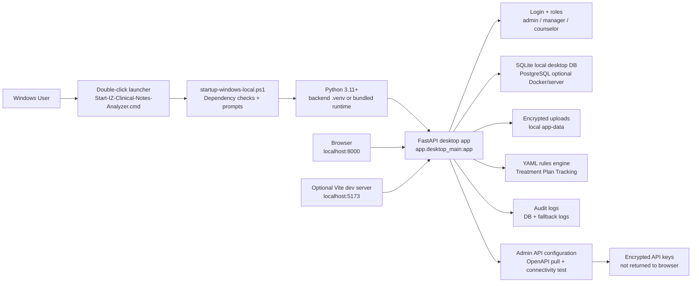

# IZ Clinical Notes Analyzer

IZ Clinical Notes Analyzer is a local-first clinical chart-review application for checking clinical note binders, Treatment Plan Tracking completeness, office-manager review workflow, role-based access control, API configuration/testing, and audit logging.

The Windows desktop direction is intentionally simple:

- runs on ordinary Windows 10 and Windows 11 machines
- uses a double-click launcher for non-technical users
- does not require Docker for local desktop use
- does not require PostgreSQL for local desktop use
- uses SQLite for local desktop data
- stores runtime data under the user's local Windows app-data folder
- checks required dependencies before launch
- asks before installing missing source-checkout dependencies
- uses a smaller Windows runtime dependency file for ordinary local runs
- keeps deterministic Treatment Plan Tracking completeness rules in YAML configuration
- provides an in-app admin API configuration and connectivity-test page
- provides PowerShell scripts for full-stack, API configuration, and Alleva/OpenAPI connectivity tests

## Start Here: Windows 11 Non-Technical User Guide

Use this section when you just want to start the app on a Windows 11 laptop.

### What you need

For a packaged release folder, the goal is that everything needed is already included.

For a source-code checkout, the Windows laptop needs:

1. Windows 11.
2. Python 3.11 or newer.
3. Internet access the first time dependencies are installed.
4. Node.js LTS only if the React browser UI has not already been built into `frontend\dist`.

The app does **not** require Docker or PostgreSQL for the normal Windows desktop run.

### Step 1: Put the app folder somewhere local

Use a normal local folder such as:

```text
C:\Users\<your-user>\local-apps\IZ_clinical-notes-analyzer
```

Avoid running the live app folder directly from OneDrive, Dropbox, iCloud Drive, Google Drive, or a network share. The app stores the actual runtime database and uploads under Windows local app data, but local source folders are still more reliable for startup scripts and virtual environments.

### Step 2: Double-click the launcher

In Windows File Explorer, open the app folder and double-click:

```text
scripts\Start-IZ-Clinical-Notes-Analyzer.cmd
```

That is the main start button for non-technical users.

It opens a command window titled:

```text
IZ Clinical Notes Analyzer
```

If startup fails, the window stays open and tells you to review the messages and logs.

### Step 3: Answer dependency prompts

On a source checkout, the app checks whether required Python packages are already installed in `backend\.venv`.

If packages are missing, it says that the app needs local Python packages and asks:

```text
Do you want to install these now? Type Y for yes or N for no
```

Type:

```text
Y
```

and press Enter.

The source-checkout runtime installs from:

```text
backend\requirements-windows-local.txt
```

That file is intentionally smaller than the developer requirements file.

If the browser UI files are missing and Node.js/npm is available, the launcher may also ask before building the frontend. Type `Y` to let it build `frontend\dist`.

### Step 4: Save the first admin password

On first launch, the startup window prints something like:

```text
First sign-in credentials:
  Username: admin
  Password: <generated-password>
```

Save that password securely.

The password is also stored in:

```text
%LOCALAPPDATA%\IZ Clinical Notes Analyzer\.env
```

### Step 5: Use the app in the browser

The app should open automatically. If it does not, open a browser and go to:

```text
http://localhost:8000
```

Useful local pages:

| Page | Address |
| --- | --- |
| App home | `http://localhost:8000` |
| API health | `http://localhost:8000/api/health` |
| Readiness | `http://localhost:8000/api/readiness` |
| API configuration page | `http://localhost:8000/api-configuration` |

## What the Windows launcher does

`Start-IZ-Clinical-Notes-Analyzer.cmd` runs:

```text
scripts\startup-windows-local.ps1
```

The startup script:

1. creates local runtime folders under `%LOCALAPPDATA%\IZ Clinical Notes Analyzer`
2. creates a local `.env` file if one does not already exist
3. generates local secrets and a bootstrap admin password
4. finds or creates `backend\.venv`
5. verifies Python 3.11 or newer
6. checks required Python packages before launch
7. asks before installing missing Python packages
8. installs from the lean Windows runtime file, `backend\requirements-windows-local.txt`
9. validates the YAML Treatment Plan rules configuration without requiring `pytest`
10. checks whether `frontend\dist` already exists
11. asks before using Node/npm to install and build frontend files when needed
12. starts the local FastAPI desktop app on `http://localhost:8000`
13. opens the browser unless started with `-NoBrowser`

For automated setup, developers can run the startup script with:

```powershell
powershell.exe -NoProfile -ExecutionPolicy Bypass -File .\scripts\startup-windows-local.ps1 -AssumeYes
```

## Windows command-line startup

If double-clicking the launcher is blocked, open PowerShell in the repo root and run:

```powershell
powershell.exe -NoProfile -ExecutionPolicy Bypass -File .\scripts\startup-windows-local.ps1
```

To start without opening a browser automatically:

```powershell
powershell.exe -NoProfile -ExecutionPolicy Bypass -File .\scripts\startup-windows-local.ps1 -NoBrowser
```

The one-time execution-policy bypass does not permanently change the Windows machine's PowerShell policy.

## Windows runtime data locations

The Windows local runtime uses the user's local app-data folder rather than the repo folder.

Default runtime root:

```text
%LOCALAPPDATA%\IZ Clinical Notes Analyzer
```

Important files and folders:

| Path | Purpose |
| --- | --- |
| `%LOCALAPPDATA%\IZ Clinical Notes Analyzer\.env` | Local runtime configuration, generated secrets, bootstrap admin password |
| `%LOCALAPPDATA%\IZ Clinical Notes Analyzer\clinical-notes-analyzer.sqlite3` | Local SQLite application database |
| `%LOCALAPPDATA%\IZ Clinical Notes Analyzer\uploads` | Encrypted uploaded clinical note files |
| `%LOCALAPPDATA%\IZ Clinical Notes Analyzer\logs` | Startup logs and fallback audit logs |
| `%LOCALAPPDATA%\IZ Clinical Notes Analyzer\api-connectivity-reports` | Optional Alleva connectivity JSON reports |

Test scripts use separate app-data folders so they do not overwrite the normal desktop runtime.

## Main user workflows

### Counselor or uploader

1. Sign in.
2. Open the upload/review intake area.
3. Enter `patient_id`, or allow the app to try to detect it from file names and readable file contents.
4. Add clinical note files and metadata.
5. Submit the upload.
6. The app stores the binder, extracts readable text, and creates automated review output.

### Reviewer or manager

1. Open the review queue.
2. Select the patient chart.
3. Review system summary and checklist results.
4. Confirm, reject, or mark checklist items as not applicable.
5. Approve the chart or return it with a comment.

### Administrator

Admins can also:

- create and manage users
- unlock users or require password reset
- review forensic logs
- update app settings
- review system readiness
- test future EMR/API connector settings
- open the API configuration and connectivity-test page

## User roles

| Role | Purpose |
| --- | --- |
| `admin` | Full access, including user management, settings, logs, charts, uploads, rules, and API configuration |
| `manager` | Review charts, patient note sets, approvals, and return-to-counselor workflow |
| `counselor` | Upload note sets and view permitted charts/uploads |

## API configuration and connectivity testing

The Windows desktop runtime includes an admin-only API configuration page:

```text
http://localhost:8000/api-configuration
```

The page lets an admin:

1. sign in with the local admin account
2. enter or update API vendor/base URL details
3. enter an API key for a one-time test or save it for later use
4. pull OpenAPI/Swagger definitions from a Swagger UI page or direct JSON URL
5. test connectivity from inside the running app
6. review non-secret test results such as probed URLs, HTTP status codes, OpenAPI title/version, path counts, schema counts, security scheme names, and sample paths

Secret handling:

- saved API keys are encrypted before storage
- API keys are not returned to the browser after save
- API keys are not written into audit-log details
- one-time pasted API keys can be used for a test without saving them

Desktop API configuration routes:

```text
GET   /api/api-configuration
PATCH /api/api-configuration
POST  /api/api-configuration/pull-definitions
POST  /api/api-configuration/test
GET   /api/api-configuration/sample-openapi.json
```

The privileged routes require an authenticated admin bearer token. The sample OpenAPI JSON endpoint is intentionally non-sensitive and exists so local smoke tests can validate the definition-pull logic without live Alleva credentials or internet access.

More detail is documented in:

```text
docs\api-configuration-and-connectivity.md
```

## Alleva API connectivity test script

The repo also includes a standalone PowerShell connectivity probe for Alleva/OpenAPI discovery.

Run from PowerShell in the repo root:

```powershell
.\scripts\test-alleva-api-connectivity.ps1
```

To write a JSON report:

```powershell
.\scripts\test-alleva-api-connectivity.ps1 -WriteJsonReport
```

Default Swagger UI target:

```text
https://api.allevasoft.com/swagger/index.html
```

The script probes:

- Swagger UI
- `/swagger/v1/swagger.json`
- `/swagger.json`
- `/openapi.json`
- API root

Reports are written to:

```text
%LOCALAPPDATA%\IZ Clinical Notes Analyzer\api-connectivity-reports
```

If protected endpoints require credentials, set credentials only as temporary PowerShell environment variables. Do not write credentials into source files, README files, YAML files, or `.env.example`.

Bearer token example:

```powershell
$env:ALLEVA_API_BEARER_TOKEN = "paste-token-here"
.\scripts\test-alleva-api-connectivity.ps1 -WriteJsonReport
Remove-Item Env:\ALLEVA_API_BEARER_TOKEN
```

API key example:

```powershell
$env:ALLEVA_API_KEY = "paste-api-key-here"
.\scripts\test-alleva-api-connectivity.ps1 -WriteJsonReport
Remove-Item Env:\ALLEVA_API_KEY
```

## Windows developer and test workflow

Use these commands when validating a Windows source checkout.

### Full local app stack test

```powershell
.\scripts\test-local-app-stack.ps1
```

The test script:

1. creates `backend\.venv` if needed
2. installs backend developer/test dependencies from `backend\requirements.txt`
3. creates a temporary test `.env`
4. configures SQLite for the test run
5. runs backend unit tests under `backend\tests`
6. starts a test server
7. checks `/api/health`
8. checks `/api/readiness`
9. logs in as the generated test admin
10. calls `/api/users/me`
11. stops the test server

Use a different test port:

```powershell
.\scripts\test-local-app-stack.ps1 -Port 8010
```

Skip dependency installation after the environment is already prepared:

```powershell
.\scripts\test-local-app-stack.ps1 -SkipDependencyInstall
```

### Focused API configuration smoke test

```powershell
.\scripts\test-api-configuration-local.ps1
```

This script validates the API configuration page and endpoints against a local sample OpenAPI definition. It does not require live Alleva credentials.

Use a different port:

```powershell
.\scripts\test-api-configuration-local.ps1 -Port 8021
```

Skip dependency installation after the environment is already prepared:

```powershell
.\scripts\test-api-configuration-local.ps1 -SkipDependencyInstall
```

## Backend and frontend dependencies

There are two Python requirements files with different purposes.

| File | Purpose |
| --- | --- |
| `backend\requirements-windows-local.txt` | Lean runtime dependencies for ordinary Windows desktop startup |
| `backend\requirements.txt` | Developer/test/server dependencies, including test tooling and extra backend components |

The Windows double-click startup path uses `requirements-windows-local.txt` when packages are missing. Developer test scripts may still use `requirements.txt` because they run pytest and broader test tooling.

Frontend dependencies are under:

```text
frontend\package.json
```

For ordinary users, the preferred release shape is to include already-built frontend files under:

```text
frontend\dist
```

If `frontend\dist` is missing in a source checkout, the startup script can ask before using Node/npm to install frontend packages and build the UI.

## Running backend pieces manually on Windows

Most users should use the double-click launcher. These manual commands are for debugging.

Create or reuse the backend virtual environment:

```powershell
cd C:\path\to\IZ_clinical-notes-analyzer
python -m venv backend\.venv
.\backend\.venv\Scripts\python.exe -m pip install --upgrade pip
.\backend\.venv\Scripts\python.exe -m pip install -r backend\requirements-windows-local.txt
```

Start the local desktop API manually:

```powershell
$env:IZ_CNA_ENV_FILE = "$env:LOCALAPPDATA\IZ Clinical Notes Analyzer\.env"
$env:PYTHONPATH = "$PWD\backend"
.\backend\.venv\Scripts\python.exe -m uvicorn app.desktop_main:app --app-dir backend --host 127.0.0.1 --port 8000
```

Then open:

```text
http://localhost:8000
```

## Running frontend pieces manually on Windows

The Windows local backend can serve built frontend assets if `frontend\dist` exists. During active frontend development, run Vite separately.

Install frontend dependencies:

```powershell
cd frontend
npm install
```

Start the Vite dev server:

```powershell
npm run dev
```

Default Vite URL:

```text
http://localhost:5173
```

Build production frontend assets:

```powershell
cd frontend
npm run build
```

Expected build output:

```text
frontend\dist
```

After building, restart the Windows local backend.

## Treatment Plan Tracking rules

The first deterministic completeness workflow is configured here:

```text
config\rules\alleva_treatment_plan_completeness_rules.yaml
```

The rules engine lives here:

```text
backend\app\services\rules_engine.py
```

The rules API boundary lives here:

```text
backend\app\api\rules_routes.py
```

The rules-engine unit tests live here:

```text
backend\tests\test_rules_engine.py
```

The Windows startup script validates the rules configuration before launch without requiring pytest in the ordinary Windows runtime path.

Rules-file guardrails:

- keep PHI out of YAML rules files
- keep vendor credentials out of YAML rules files
- treat YAML rules as deterministic business logic, not LLM prompts
- add future workflows as versioned rules profiles under `config\rules`

## EMR and API readiness

The app is upload-first today. It also has EMR/API connector boundaries for future integration work.

Current EMR/API behavior:

- Admin settings can store EMR vendor label, FHIR base URL, SMART client ID/secret, scopes, and timeout.
- `GET /api/emr/profile` reports configured SMART/FHIR profile information.
- `POST /api/emr/discover` validates SMART `.well-known/smart-configuration` discovery when a real EMR FHIR base URL is available.
- `GET /api/emr/import-plan?patient_id=...` shows the planned FHIR R4 `Patient`, `DocumentReference`, `Binary`, and optional `Provenance` request flow.
- The API configuration page can store encrypted API keys, pull OpenAPI/Swagger definitions, and test connectivity.
- Alleva live API import remains gated until client/vendor credentials, tenant base URLs, attachment behavior, pagination/rate-limit rules, and official documentation are available.

The local connectivity scripts and sample OpenAPI endpoint do not import patient data.

## Default local URLs

Windows local desktop runtime:

| Purpose | URL |
| --- | --- |
| App | `http://localhost:8000` |
| API health | `http://localhost:8000/api/health` |
| Readiness | `http://localhost:8000/api/readiness` |
| Backend API base | `http://localhost:8000/api` |
| API configuration page | `http://localhost:8000/api-configuration` |
| API configuration sample OpenAPI | `http://localhost:8000/api/api-configuration/sample-openapi.json` |

Frontend dev mode, when run separately:

| Purpose | URL |
| --- | --- |
| Vite frontend | `http://localhost:5173` |
| Backend API | `http://localhost:8000/api` |

Docker/server mode defaults may expose frontend and backend separately:

| Purpose | URL |
| --- | --- |
| Docker frontend | `http://localhost:5173` |
| Docker backend | `http://localhost:8000` |
| Docker backend through frontend proxy | `http://localhost:5173/api` |

## Local configuration

The generated Windows local `.env` is stored outside the repo:

```text
%LOCALAPPDATA%\IZ Clinical Notes Analyzer\.env
```

Important local settings:

| Variable | Purpose | Windows local default |
| --- | --- | --- |
| `ENVIRONMENT` | Runtime label | `local-client` |
| `BACKEND_PORT` | Local backend port | `8000` |
| `DATABASE_BACKEND` | Local DB engine | `sqlite` |
| `LOCAL_SQLITE_DB_PATH` | SQLite database file | `clinical-notes-analyzer.sqlite3` |
| `SECRET_KEY` | JWT signing secret | generated on first startup |
| `DATA_ENCRYPTION_KEY` | upload/API-secret encryption key | generated on first startup |
| `FRONTEND_ORIGIN` | local app origin | `http://localhost:8000` |
| `FRONTEND_ORIGINS` | allowed local origins | `http://localhost:8000,http://localhost:5173` |
| `ALLOWED_HOSTS` | accepted host headers | `localhost,127.0.0.1,::1,testserver` |
| `UPLOAD_DIR` | encrypted upload location | `uploads` under app-data root |
| `LOG_DIR` | log location | `logs` under app-data root |
| `RULES_CONFIG_PATH` | Treatment Plan rules file | repo `config\rules\alleva_treatment_plan_completeness_rules.yaml` |
| `BOOTSTRAP_ADMIN_USERNAME` | bootstrap admin username | `admin` |
| `BOOTSTRAP_ADMIN_PASSWORD` | bootstrap admin password | generated on first startup |
| `RESET_BOOTSTRAP_ADMIN_ON_STARTUP` | reset bootstrap admin from `.env` on startup | `true` |
| `LLM_ENABLED` | optional LLM support | `false` |
| `EMR_API_ENABLED` | live EMR API support | `false` |

## File rules

Supported file extensions:

- `.csv`
- `.doc`
- `.docx`
- `.jpeg`
- `.jpg`
- `.pdf`
- `.png`
- `.rtf`
- `.txt`
- `.zip`

Limits:

- per-file limit: `50MB`
- total binder upload limit: `250MB`
- maximum files per binder upload: `40`

Notes:

- `.doc` files are stored securely; reliable text extraction may require conversion to `.docx`, `.pdf`, or `.txt` first.
- Patient ID auto-detection scans filenames and readable file contents.
- New uploads are encrypted before being written to disk.
- Downloads are decrypted only after authentication and authorization checks pass.

## Troubleshooting Windows local runs

### The double-click launcher opens but startup fails

The updated launcher should keep the window open if startup fails. Read the messages shown in the window, then check startup logs:

```text
%LOCALAPPDATA%\IZ Clinical Notes Analyzer\logs
```

You can also run startup from PowerShell so all messages remain visible:

```powershell
powershell.exe -NoProfile -ExecutionPolicy Bypass -File .\scripts\startup-windows-local.ps1
```

### Python is not found

For source checkout runs, install Python 3.11+ and reopen PowerShell.

Check:

```powershell
python --version
```

A packaged release should eventually include a bundled runtime and should not require the user to install Python.

### Required Python packages are missing

The startup script will say the app needs local Python packages and ask whether to install them.

Type `Y` to install from:

```text
backend\requirements-windows-local.txt
```

If the install fails, check internet access, antivirus/security blocking, and whether Python/pip can reach package repositories.

### Browser UI is missing

If `frontend\dist` is missing, the startup script can ask to build it when Node.js/npm is available.

For a non-technical deployment, prefer a packaged release that already includes:

```text
frontend\dist
```

### Port 8000 is already in use

Find the process using port 8000:

```powershell
netstat -ano | findstr :8000
```

Then stop the conflicting app or run a lean desktop start on another port:

```powershell
.\scripts\start-desktop-local.ps1 -Port 8010
```

### Login fails

Check the generated bootstrap credentials in:

```text
%LOCALAPPDATA%\IZ Clinical Notes Analyzer\.env
```

Look for:

```text
BOOTSTRAP_ADMIN_USERNAME=admin
BOOTSTRAP_ADMIN_PASSWORD=...
```

If `RESET_BOOTSTRAP_ADMIN_ON_STARTUP=true`, restarting the app resets the bootstrap admin from the `.env` values.

### Readiness fails

Open:

```text
http://localhost:8000/api/readiness
```

Also inspect:

```text
%LOCALAPPDATA%\IZ Clinical Notes Analyzer\logs
```

Common causes:

- missing Python dependencies
- invalid YAML rules file
- local app-data folder not writable
- encryption key missing or malformed
- SQLite database path not writable
- running from a cloud-synced folder that interferes with runtime file access

### Upload fails

Check for:

- unsupported file extension
- file larger than `50MB`
- total upload larger than `250MB`
- missing `patient_id` with no successful auto-detection
- conflicting detected patient IDs across uploaded files
- upload folder not writable

### API configuration test fails

Open:

```text
http://localhost:8000/api-configuration
```

Confirm you are signed in as an admin. Then check:

- API base URL
- Swagger/OpenAPI URL
- timeout seconds
- whether the endpoint requires an API key or bearer token
- local audit/log entries

For an offline local validation path, run:

```powershell
.\scripts\test-api-configuration-local.ps1
```

### Alleva connectivity script fails

Run with a JSON report:

```powershell
.\scripts\test-alleva-api-connectivity.ps1 -WriteJsonReport
```

Then review the report under:

```text
%LOCALAPPDATA%\IZ Clinical Notes Analyzer\api-connectivity-reports
```

Likely causes:

- network or DNS issue
- Alleva Swagger/OpenAPI URL changed
- endpoint requires authentication
- credentials were not set in environment variables
- proxy or security software blocked the request

## Docker and VPS runtime

Docker Compose remains available for developer/server scenarios. It is not the recommended ordinary Windows desktop-user path.

Docker runtime services:

| Service | Purpose | Default exposed port |
| --- | --- | --- |
| `frontend` | React app served through nginx and proxying `/api/*` to backend | `127.0.0.1:5173` |
| `backend` | FastAPI API, auth, workflow, uploads, audit logging, schema bootstrap | `127.0.0.1:8000` |
| `postgres` | Dedicated application-owned PostgreSQL database | `127.0.0.1:5432` |

Full Docker stack:

```bash
cp .env.example .env
docker compose up -d --build
./scripts/smoke.sh
```

Useful Docker commands:

```bash
docker compose ps
docker compose logs --tail=200
docker compose logs --tail=200 backend
docker compose logs --tail=200 frontend
docker compose logs --tail=200 postgres
docker compose down
```

Destructive Docker reset:

```bash
docker compose down -v
```

This deletes the PostgreSQL Docker volume and all database contents.

## Architecture



## Key repository files

| File | Purpose |
| --- | --- |
| `scripts\Start-IZ-Clinical-Notes-Analyzer.cmd` | Double-click Windows launcher for non-technical users |
| `scripts\startup-windows-local.ps1` | Main Windows local startup script with dependency checks and install prompts |
| `backend\requirements-windows-local.txt` | Lean Windows local runtime Python dependencies |
| `backend\requirements.txt` | Developer/test/server Python dependencies |
| `scripts\start-desktop-local.ps1` | Lean desktop runtime starter |
| `scripts\test-local-app-stack.ps1` | Full local Windows smoke test |
| `scripts\test-api-configuration-local.ps1` | Focused local API configuration smoke test |
| `scripts\test-alleva-api-connectivity.ps1` | Alleva Swagger/OpenAPI/API reachability probe |
| `backend\app\desktop_main.py` | Windows desktop FastAPI entrypoint |
| `backend\app\main.py` | Main/backend FastAPI application entrypoint for non-desktop contexts |
| `backend\app\services\runtime_checks.py` | Runtime readiness checks |
| `backend\app\services\rules_engine.py` | Deterministic YAML rules engine |
| `backend\app\api\rules_routes.py` | Rules API boundary |
| `backend\tests\test_rules_engine.py` | Rules-engine tests |
| `backend\tests\test_api_connectivity.py` | Offline API connectivity tests using mocked transport |
| `docs\api-configuration-and-connectivity.md` | API configuration workflow documentation |
| `config\rules\alleva_treatment_plan_completeness_rules.yaml` | Treatment Plan Tracking completeness rules |
| `docs\windows-local-refactor.md` | Windows local refactor notes |
| `frontend\src` | React frontend source |
| `frontend\dist` | Built frontend assets after `npm run build` |

## Backup and restore notes

For Windows local desktop runs, back up both the SQLite database and encrypted upload files.

Minimum Windows local backup set:

```text
%LOCALAPPDATA%\IZ Clinical Notes Analyzer\.env
%LOCALAPPDATA%\IZ Clinical Notes Analyzer\clinical-notes-analyzer.sqlite3
%LOCALAPPDATA%\IZ Clinical Notes Analyzer\uploads
%LOCALAPPDATA%\IZ Clinical Notes Analyzer\logs
```

Important: the `.env` contains the encryption key needed to read encrypted uploaded files and saved API secrets. Losing the `.env` may make encrypted uploads and saved API keys unrecoverable.

For Docker/PostgreSQL runs, back up the PostgreSQL database and the backend data volume separately.

PostgreSQL backup example:

```bash
pg_dump -Fc iz_clinical_notes_analyzer > backup.dump
```

PostgreSQL restore example:

```bash
pg_restore -d iz_clinical_notes_analyzer backup.dump
```

## Security and privacy guardrails

- Do not commit `.env` files.
- Do not commit SQLite runtime databases.
- Do not commit uploaded clinical documents.
- Do not commit Alleva credentials, API keys, or bearer tokens.
- Do not put PHI in YAML rules files.
- Do not paste PHI into API connectivity tests.
- Keep runtime data out of cloud-synced folders when possible.
- Treat the local `.env` as sensitive because it contains secrets and encryption keys.
- Keep deterministic completeness scoring separate from optional LLM analysis.
- Prefer packaged releases with bundled runtime and built frontend assets for true non-technical deployment.

## Current status

The app now has a Windows local runtime path designed around SQLite, local app-data storage, deterministic YAML rules, dependency checks, user prompts before source-checkout dependency installation, startup/readiness checks, an admin API configuration/testing workflow, and a double-click launcher. Docker/PostgreSQL remains available for developer and server scenarios, but it is not required for ordinary Windows 10/11 local desktop use.
