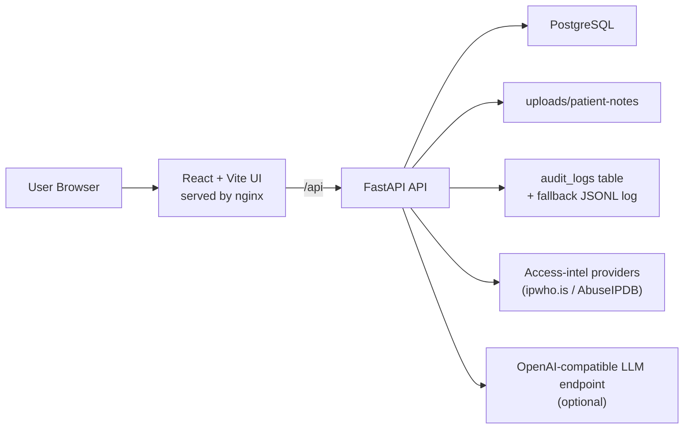

# IZ Clinical Notes Analyzer

IZ Clinical Notes Analyzer is a chart-review application for clinical note binders. It combines a React frontend, a FastAPI backend, and a dedicated PostgreSQL database to support uploads, automated checklist scoring, office-manager review, role-based access control, and forensic-style audit logging.

## What this app does

- Accepts clinical note binder uploads grouped by `patient_id`
- Auto-detects `patient_id` from uploaded files when possible
- Creates an immutable versioned note set for every upload/update
- Generates an automated review chart from the uploaded binder
- Lets reviewers confirm, reject, or mark checklist items as not applicable
- Supports office-manager approval or return-to-counselor workflow
- Keeps tamper-evident forensic audit logs for reads, writes, auth, downloads, and workflow changes
- Stores uploaded source files with SHA-256 digests for later validation

## Who should use which section

- Non-technical users: start with [Quick Start For Non-Technical Users](#quick-start-for-non-technical-users)
- Developers: use [Local Development](#local-development)
- Server operators: use [VPS Deployment](#vps-deployment) and [Troubleshooting](#troubleshooting)

## Quick Start For Non-Technical Users

If you just need to start the app and use it, use one of the startup scripts. They create `.env` if needed, prepare dependencies, start the database first, launch the app, and run a smoke test.

### macOS

1. Open Terminal in this project folder.
2. Run:

```bash
./scripts/startup-macos.sh
```

3. If asked, choose ports for the frontend, backend, and database.
4. Wait for the script to finish and open the frontend URL it prints, usually `http://localhost:5173`.

### Windows

1. Open PowerShell in this project folder.
2. Run:

```powershell
.\scripts\startup-windows.ps1
```

3. Wait for the script to finish and open `http://localhost:5173` unless you changed the port.

### Ubuntu 24.04 or VPS

1. SSH into the server and open this project folder.
2. Run:

```bash
./scripts/startup-ubuntu-24.04.sh
```

3. Wait for the smoke test to pass.
4. Open the frontend on the configured `FRONTEND_PORT`.

### First sign-in

- Username: value of `BOOTSTRAP_ADMIN_USERNAME` in `.env`
- Password: value of `BOOTSTRAP_ADMIN_PASSWORD` in `.env`
- Default bootstrap values created by the helper scripts:
  - username: `admin`
  - password: `r3!@analyzer#123`

Change the bootstrap password in `.env` before production use. The bootstrap admin password is managed outside the app and is reset from `.env` on startup when `RESET_BOOTSTRAP_ADMIN_ON_STARTUP=true`.

## Simple User Instructions

### Counselor or uploader

1. Sign in.
2. Open `Upload clinical notes`.
3. Enter the `patient_id`, or leave it blank and let the app try to detect it from the files.
4. Add the clinical note files and their metadata.
5. Submit the upload.
6. The app creates a binder, stores the files, and generates an automated review chart.

### Reviewer or manager

1. Open `Review queue`.
2. Select the patient chart.
3. Read the system summary and checklist results.
4. Confirm or correct the checklist items.
5. Approve the chart or return it with a comment.

### Administrator

Admins can also:

- create and manage users
- unlock users or require password reset
- review forensic logs
- update app settings for access-intel and LLM analysis

## How The App Runs

### Runtime services

The normal runtime is Docker Compose with three services:

| Service | Purpose | Default exposed port |
| --- | --- | --- |
| `frontend` | Serves the React app through nginx and proxies `/api/*` to the backend | `5173` |
| `backend` | FastAPI API, auth, workflow, uploads, audit logging, schema bootstrap | `8000` |
| `postgres` | Dedicated application-owned PostgreSQL database | `5432` |

### Startup sequence

When you use one of the startup scripts, the app starts in this order:

1. Create `.env` from `.env.example` if it does not exist.
2. Normalize or choose ports.
3. Fill in dedicated database settings in `.env`.
4. Start the `postgres` container first.
5. Ensure the application database exists and is owned by the configured database user.
6. Start the full Docker Compose stack.
7. Let the backend:
   - wait for the database
   - add missing legacy columns with defensive schema compatibility checks
   - create tables if needed
   - create or reset the bootstrap admin account
8. Run `./scripts/smoke.sh` to verify the frontend, API health, login, and chart loading path.

### Health endpoints

- `GET /health`
- `GET /api/health`

### Default URLs

- Frontend: `http://localhost:5173`
- Backend API: `http://localhost:8000`
- Backend through frontend proxy: `http://localhost:5173/api`
- PostgreSQL: `127.0.0.1:5432`

## Architecture



### Frontend

- Single-page React app in `frontend/src/App.tsx`
- Built with Vite and served by nginx in Docker
- Uses `/api` by default, so the browser usually talks only to the frontend host
- Main views:
  - summary dashboard
  - review queue
  - upload clinical notes
  - profile
  - user management
  - forensic logs
  - settings

### Backend

The FastAPI backend is responsible for:

- JWT login and password-reset flows
- role-based access control
- chart creation and workflow transitions
- patient note set uploads and file downloads
- automatic checklist evaluation
- access-intelligence lookups during login
- optional OpenAI-compatible LLM gap analysis
- forensic request and database audit logging

Key backend files:

- `backend/app/main.py`: app creation, CORS, health routes, startup bootstrap, request audit middleware
- `backend/app/api/routes.py`: API routes and role checks
- `backend/app/core/config.py`: settings and database URL rules
- `backend/app/db/session.py`: SQLAlchemy engine/session setup and Docker DB host rewriting
- `backend/app/db/bootstrap.py`: defensive schema compatibility layer
- `backend/app/services/evaluation.py`: automatic checklist scoring from uploaded binder contents
- `backend/app/services/patient_notes.py`: upload storage, text extraction, file validation, patient ID detection
- `backend/app/services/audit.py`: request logging, event logging, DB change capture, fallback audit spool

### Database and storage model

Main tables:

- `users`
- `app_settings`
- `charts`
- `audit_item_responses`
- `workflow_transitions`
- `patient_note_sets`
- `patient_note_documents`
- `audit_logs`

File storage:

- Uploaded files are stored under `uploads/patient-notes/...` by default.
- Storage is organized by sanitized `patient_id`, note set ID, and document ID.
- Every stored file records:
  - original filename
  - content type
  - size in bytes
  - SHA-256 digest

### Workflow model

The main workflow is:

1. A counselor or uploader creates a patient note binder.
2. The backend stores the files and metadata.
3. The backend generates an automated evaluation report.
4. A chart is created and moved into `Awaiting Office Manager Review`.
5. A manager or admin reviews, approves, or returns the chart.
6. Every step is written to the forensic audit log.

### Optional external integrations

- Access intelligence:
  - geolocation lookup via `ipwho.is`
  - reputation lookup via AbuseIPDB
- LLM analysis:
  - any OpenAI-compatible `/chat/completions` endpoint
  - used for access-review summarization and evaluation gap analysis when enabled in app settings

## Current App Behavior

### Roles

- `admin`
  - full access
  - can manage users, settings, logs, charts, and uploads
- `manager`
  - can review charts and patient note sets
  - can approve or return charts
- `counselor`
  - can upload note sets
  - can view only their own charts and uploads

### Password behavior

- Managed users can be forced to reset passwords.
- Accounts lock after 5 failed login attempts.
- The bootstrap admin password cannot be changed in-app.
- If `RESET_BOOTSTRAP_ADMIN_ON_STARTUP=true`, the bootstrap admin is reset from `.env` on every startup.

### Binder versioning

- Initial upload requires `upload_mode=initial`
- Later changes require `upload_mode=update`
- Updates do not overwrite history
- The prior note set becomes `superseded`
- The new upload becomes the active immutable version

### File rules

- Supported file extensions:
  - `.csv`
  - `.doc`
  - `.docx`
  - `.jpeg`
  - `.jpg`
  - `.pdf`
  - `.png`
  - `.rtf`
  - `.txt`
  - `.zip`
- Per-file limit: `50MB`
- Patient ID auto-detection scans filenames and readable file contents up to a smaller detection limit

## Configuration

### Important environment variables

These are the settings you will use most often:

| Variable | Purpose | Default |
| --- | --- | --- |
| `BACKEND_PORT` | Host port for the FastAPI service | `8000` |
| `FRONTEND_PORT` | Host port for the nginx-served frontend | `5173` |
| `POSTGRES_PORT` | Host port for PostgreSQL | `5432` |
| `DATABASE_NAME` | Dedicated app database name | `iz_clinical_notes_analyzer` |
| `DATABASE_USER` | Dedicated app DB user | `iz_clinical_notes_app` |
| `DATABASE_PASSWORD` | Dedicated app DB password | `change-me-app` |
| `DATABASE_URL` | Optional full SQLAlchemy DSN override | blank |
| `SECRET_KEY` | JWT signing key | `change-me` / container fallback `change-me-in-production` |
| `FRONTEND_ORIGIN` | Primary frontend origin | `http://localhost:5173` |
| `FRONTEND_ORIGINS` | Comma-separated allowed origins | `http://localhost:5173` |
| `BOOTSTRAP_ADMIN_USERNAME` | Bootstrap admin username | `admin` |
| `BOOTSTRAP_ADMIN_PASSWORD` | Bootstrap admin password | `r3!@analyzer#123` |
| `RESET_BOOTSTRAP_ADMIN_ON_STARTUP` | Reset bootstrap admin from `.env` every startup | `true` |
| `UPLOAD_DIR` | Upload storage directory | `uploads` |
| `POSTGRES_SERVICE_HOST` | Docker-internal host name for Postgres | `postgres` |

### Database rules

- This app only supports its own isolated PostgreSQL instance.
- The backend rejects non-local/non-Compose PostgreSQL hosts.
- If `DATABASE_URL` uses `localhost` and the backend is running inside Docker, the backend rewrites the host to `postgres`.

## Local Development

### Full Docker stack

```bash
cp .env.example .env
docker compose up -d --build
./scripts/smoke.sh
```

### Backend only

Run PostgreSQL in Docker, then run the backend from your host:

```bash
cp .env.example .env
docker compose up -d postgres
cd backend
python -m venv .venv
source .venv/bin/activate
pip install -r requirements.txt
export PYTHONPATH=$(pwd)
uvicorn app.main:app --host 0.0.0.0 --port 8000
```

### Frontend only

```bash
cd frontend
npm install
VITE_API_URL=http://localhost:8000/api npm run dev
```

### Tests

```bash
cd backend && PYTHONPATH=$(pwd) pytest
cd frontend && npm test
cd frontend && npm run build
```

### Useful development commands

```bash
docker compose ps
docker compose logs --tail=200
docker compose logs --tail=200 backend
docker compose logs --tail=200 frontend
docker compose logs --tail=200 postgres
```

## VPS Deployment

The current server deployment model is the Ubuntu startup script plus Docker Compose. There is no separate deployment service in this repository.

### First-time VPS setup

1. Clone the repo to the server.
2. Create or review `.env`.
3. Change at least these values before going live:
   - `SECRET_KEY`
   - `DATABASE_PASSWORD`
   - `BOOTSTRAP_ADMIN_PASSWORD`
   - `FRONTEND_ORIGIN`
   - `FRONTEND_ORIGINS`
4. Run:

```bash
./scripts/startup-ubuntu-24.04.sh
```

5. Confirm:
   - `docker compose ps`
   - `curl http://localhost:8000/health`
   - `curl http://localhost:<FRONTEND_PORT>/api/health`

### Updating the VPS after a code change

```bash
git pull
./scripts/startup-ubuntu-24.04.sh
```

The script pulls images where possible, ensures the DB exists, rebuilds containers, and reruns the smoke test.

### Restarting without redeploying

```bash
docker compose up -d
```

### Stopping the app

```bash
docker compose down
```

### Destructive reset

This deletes the PostgreSQL volume and all DB contents:

```bash
docker compose down -v
```

On Ubuntu there is also a helper path for auth-mismatch recovery:

```bash
RESET_DEDICATED_DB_VOLUME_ON_AUTH_FAILURE=1 ./scripts/startup-ubuntu-24.04.sh
```

Use that only if you intentionally want to recreate the dedicated database volume.

## Troubleshooting

### Docker starts but the site does not open

Check:

```bash
docker compose ps
docker compose logs --tail=200
```

Common causes:

- Docker Desktop or Docker Engine is not actually running
- the chosen frontend port is already in use
- the backend failed health checks because it could not connect to the database

### A port is already busy

- macOS script prompts you to choose another port
- Ubuntu script auto-selects the next open port
- Check what the app chose in `.env`

### Login fails or the account becomes locked

- Accounts lock after 5 bad passwords.
- An admin can unlock managed accounts in the UI.
- For the bootstrap admin, verify `BOOTSTRAP_ADMIN_USERNAME` and `BOOTSTRAP_ADMIN_PASSWORD` in `.env`, then restart the app.

### The bootstrap admin password keeps changing back

That is expected when `RESET_BOOTSTRAP_ADMIN_ON_STARTUP=true`.

Use one of these approaches:

- keep the desired bootstrap password in `.env`
- set `RESET_BOOTSTRAP_ADMIN_ON_STARTUP=false` if you intentionally do not want startup resets

Remember: the bootstrap admin password cannot be changed from inside the app.

### Database password mismatch after an earlier install

This usually happens when the Postgres volume was initialized with older credentials.

Safe fix:

- restore the original `DATABASE_USER` and `DATABASE_PASSWORD` in `.env`

Destructive fix:

- recreate the volume with `docker compose down -v`
- or on Ubuntu use `RESET_DEDICATED_DB_VOLUME_ON_AUTH_FAILURE=1 ./scripts/startup-ubuntu-24.04.sh`

### Backend says it cannot reach PostgreSQL

Check:

```bash
docker compose logs --tail=200 postgres
docker compose logs --tail=200 backend
```

Also verify:

- `DATABASE_HOST=127.0.0.1` for host-side backend runs
- `POSTGRES_SERVICE_HOST=postgres`
- `DATABASE_NAME`, `DATABASE_USER`, and `DATABASE_PASSWORD` match the current volume state

### Frontend cannot talk to backend

Check these settings in `.env`:

- `FRONTEND_ORIGIN`
- `FRONTEND_ORIGINS`

For Docker Compose, the browser normally talks to the frontend port and nginx proxies `/api` to the backend.

### Upload fails

Check for:

- unsupported file extension
- file larger than `50MB`
- missing `patient_id` with no successful auto-detection
- conflicting detected patient IDs across uploaded files

### Uploaded files are missing

Stored files live under `UPLOAD_DIR/patient-notes/...` which defaults to `./uploads/patient-notes/...`.

If a database row exists but the file is gone:

- download will fail with `Stored patient note file is missing`
- investigate backups or restore the missing files to the same storage path

### Audit logs are not reaching the database

If audit persistence fails, the app writes fallback records to:

```text
logs/forensic-audit-fallback.jsonl
```

Check that file if the `audit_logs` table is missing expected events.

### Smoke test fails

Run it manually:

```bash
./scripts/smoke.sh
```

It verifies:

- frontend HTML loads
- `/api/health` returns `{"status":"ok"}`
- login works
- `/api/users/me` works
- chart list loads when password reset is not required

## Backups And Restore

Use the dedicated application DB name consistently.

### Backup

```bash
pg_dump -Fc iz_clinical_notes_analyzer > backup.dump
```

### Restore

```bash
pg_restore -d iz_clinical_notes_analyzer backup.dump
```

Validate uploaded-file backups separately if you need full recovery, because database backups do not include the `uploads/` directory.

## Repository Layout

```text
backend/                     FastAPI app, models, services, tests
frontend/                    React/Vite UI and nginx config
scripts/                     Startup and smoke-test helpers
docs/                        Supporting runbook and architecture notes
uploads/                     Stored clinical note files at runtime
logs/                        Startup logs and audit fallback logs
docker-compose.yml           Main local/VPS runtime definition
```

## Important Notes

- This project is designed around an application-owned PostgreSQL container, not a shared external database.
- The backend performs defensive schema compatibility updates on startup for older database volumes.
- The frontend is served from nginx in Docker and proxies API traffic to the backend.
- The bootstrap admin account is environment-managed and behaves differently from regular managed users.
