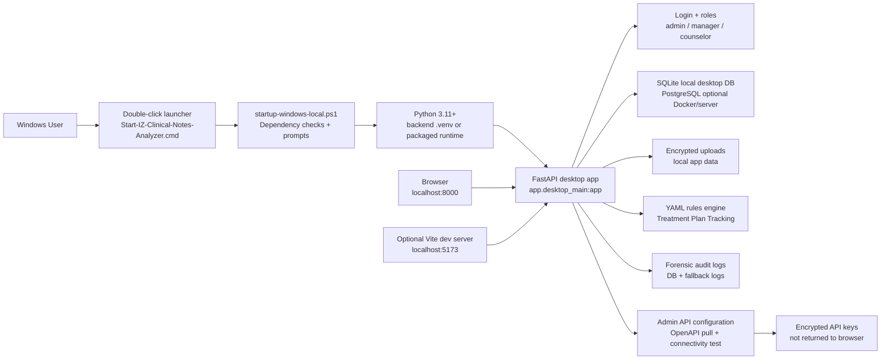

# IZ Clinical Notes Analyzer

IZ Clinical Notes Analyzer is a local-first clinical chart-review app for checking whether client clinical-note binders are complete before office-manager approval. It is built for ordinary Windows 10/11 desktop use, with FastAPI on the backend, a React browser interface, SQLite for the normal local database, encrypted local file storage, role-based access control, deterministic Treatment Plan Tracking rules, readiness checks, version visibility, API connectivity testing, and forensic audit logging.

The normal user path does not require Docker, PostgreSQL, cloud hosting, or a database administrator. The app runs on the user's own computer at `http://localhost:8000`.

## Plain-English Summary

Use this app to:

- upload a patient's clinical-note bundle
- let the system check the bundle against configured Treatment Plan Tracking completeness rules
- review missing, incomplete, or manually-confirmed items
- route the chart to an office manager
- approve the chart or return it to the counselor with comments
- keep a local audit trail of sign-ins, uploads, reviews, settings changes, and API tests
- test future Alleva/API connectivity without pretending live patient import is ready

Important boundaries:

- Uploaded files are encrypted before storage.
- Runtime data is stored under the user's local app-data folder, not inside the source-code folder.
- Saved API keys are encrypted and are not returned to the browser.
- Live Alleva patient import is not enabled until real tenant credentials, endpoint mapping, scopes, pagination, attachment behavior, rate limits, and vendor documentation are provided.
- Do not use real PHI in development, testing, screenshots, documentation, Git commits, or API connectivity probes unless the deployment has been approved for production PHI handling.

## Who Uses It

| Person | What they do |
| --- | --- |
| Counselor | Uploads clinical-note binders and reviews returned items. |
| Manager | Reviews charts, confirms checklist items, approves charts, or returns them with comments. |
| Admin | Manages users, settings, readiness checks, forensic logs, API connectivity, and local configuration. |

## What Is Included Today

Current functionality:

- Local Windows desktop launch through `scripts\Start-IZ-Clinical-Notes-Analyzer.cmd`.
- FastAPI desktop runtime served from one local URL.
- React UI for sign-in, dashboard, review queue, manual uploads, user management, settings, forensic logs, profile, and version footer.
- Bootstrap local admin account on first startup.
- Required password reset flow.
- Role-based access for `admin`, `manager`, and `counselor`.
- User create, edit, password reset, lock/unlock, deactivate/reactivate, and delete controls where allowed.
- Patient-note binder upload with initial/update modes.
- File metadata capture, including document labels, dates, source system, clinician, level of care, signatures, source IDs, and notes.
- Patient ID auto-detection from filenames and readable file contents.
- Immutable binder versioning for later updates.
- Secure download of stored source documents after authentication and authorization.
- Deterministic YAML rules for Treatment Plan Tracking completeness checks.
- Generated chart audit findings and checklist responses.
- Manager approval and return-to-counselor workflow.
- Admin-visible readiness checks.
- API health and version endpoints.
- Local API configuration page for vendor/base URL/API key testing.
- OpenAPI/Swagger definition discovery and sample offline OpenAPI test endpoint.
- Operation test workbench for selected OpenAPI operations.
- EMR/FHIR readiness endpoints for future SMART/FHIR integration planning.
- Forensic audit logs with request metadata, actor identity, event categories, CEF payloads, FHIR AuditEvent JSON, and tamper-evident hash chaining.
- Runtime fallback JSONL audit log if database logging fails.
- Local encrypted storage for uploaded clinical files and saved API secrets.
- Synthetic sample clinical notes under `docs\sample-clinical-notes`.
- Windows PowerShell smoke scripts for local stack, API configuration, and Alleva/OpenAPI reachability.
- Docker/PostgreSQL support for developer or server scenarios only.

## Quick Start For Non-Technical Windows Users

### What you need

For a packaged release folder, the goal is that everything needed is already included.

For a source-code checkout, the Windows computer needs:

1. Windows 10 or Windows 11.
2. Python 3.11 or newer.
3. Internet access the first time Python packages are installed.
4. Node.js LTS only if the browser UI has not already been built into `frontend\dist`.

The ordinary local desktop run does not require Docker or PostgreSQL.

### Step 1: Put the app in a local folder

Use a normal local folder such as:

```text
C:\Users\<your-user>\local-apps\IZ_clinical-notes-analyzer
```

Avoid running the source checkout directly from OneDrive, Dropbox, iCloud Drive, Google Drive, or a network share. The app stores runtime data under Windows local app data, but local source folders are more reliable for startup scripts, virtual environments, and browser UI files.

### Step 2: Double-click the launcher

Open the app folder in Windows File Explorer and double-click:

```text
scripts\Start-IZ-Clinical-Notes-Analyzer.cmd
```

This opens a command window titled:

```text
IZ Clinical Notes Analyzer
```

If startup fails, the window stays open so you can read the message.

### Step 3: Allow dependency setup if prompted

On a source checkout, the app checks whether local Python packages exist in `backend\.venv`.

If packages are missing, it asks:

```text
Do you want to install these now? Type Y for yes or N for no
```

Type:

```text
Y
```

and press Enter.

The Windows source-checkout runtime installs from:

```text
backend\requirements-windows-local.txt
```

If `frontend\dist` is missing and Node.js/npm is available, the launcher may also ask before building the browser UI. Type `Y` to let it build.

### Step 4: Save the first admin password

On first launch, the startup window prints first sign-in credentials similar to:

```text
Username: admin
Password: <generated-password>
```

Save that password securely.

The generated local configuration is stored here:

```text
%LOCALAPPDATA%\IZ Clinical Notes Analyzer\.env
```

That file contains secrets and encryption keys. Treat it like a password vault item.

### Step 5: Open the app

The app should open automatically. If it does not, open a browser and go to:

```text
http://localhost:8000
```

Useful local pages:

| Page | Address |
| --- | --- |
| App home | `http://localhost:8000` |
| Manual upload | `http://localhost:8000/?view=uploads` |
| Clinical notes intake guide | `http://localhost:8000/clinical-notes-intake` |
| API configuration | `http://localhost:8000/api-configuration` |
| API health | `http://localhost:8000/api/health` |
| Readiness | `http://localhost:8000/api/readiness` |
| Version | `http://localhost:8000/api/version` |
| API docs | `http://localhost:8000/docs` |

## Everyday Use

### Sign in

1. Open `http://localhost:8000`.
2. Enter the assigned username and password.
3. If the app says a password reset is required, enter a new password before continuing.

### Upload a patient note binder

1. Open `Manual upload`.
2. Choose `initial` for a first binder or `update` for a later version.
3. Enter a `patient_id` when known.
4. Add the client name, dates, clinician, level of care, source system, and notes when available.
5. Add the clinical files.
6. Review the automatically detected patient ID, if shown.
7. Classify each document with a label, type, source bucket, document date, completion status, and signature fields when relevant.
8. Submit the upload.

The app stores the binder, encrypts uploaded files, extracts readable text where possible, creates or updates the review chart, and runs configured completeness checks.

### Review a chart

1. Open `Review queue` or `Chart audit`.
2. Select a chart.
3. Review the system-generated summary and checklist.
4. Mark each item as confirmed, missing/incorrect, not applicable, or needing manual confirmation.
5. Save changes.

### Approve or return a chart

Managers and admins can:

- approve a chart
- return a chart to the counselor with a required comment
- re-review returned charts after updates

Counselors can upload or update binders and review returned items, but manager approval actions are restricted.

### Manage users

Admins can open `User management` to:

- create users
- assign roles
- edit names and roles
- reset passwords
- require password resets
- unlock users
- activate or deactivate users
- delete users when the app allows it

The bootstrap `admin` account is protected from unsafe deletion.

### Review forensic logs

Admins can open `Forensic logs` to review audited events. Logs can be filtered by patient ID, action, and event category.

The audit system records request metadata and event details, but it should not log uploaded note text, PHI-like clinical content, API keys, bearer tokens, passwords, or encryption keys.

### Configure settings

Admins can open `Settings` to review:

- organization label
- access-intelligence settings
- optional LLM settings
- future EMR/FHIR connector settings
- runtime readiness
- EMR profile
- SMART/FHIR discovery checks
- planned import workflow for a patient ID

Optional LLM features are disabled by default. Keep deterministic rules as the primary completeness-check path.

## Supported Files

Supported upload extensions:

- `.csv`
- `.doc`
- `.docx`
- `.jpeg`
- `.jpg`
- `.pdf`
- `.png`
- `.rtf`
- `.txt`
- `.zip`

Limits:

| Limit | Value |
| --- | --- |
| Maximum one file | `50MB` |
| Maximum total binder upload | `250MB` |
| Maximum files in one binder upload | `40` |

Notes:

- `.doc` files are stored securely, but text extraction is more reliable from `.docx`, `.pdf`, `.txt`, `.csv`, and readable text exports.
- Patient ID auto-detection scans filenames and readable file contents.
- If multiple conflicting patient IDs are detected, verify the binder before submitting.
- Downloads are decrypted only after authentication and authorization checks pass.

## Local Data Locations

The Windows desktop runtime stores data outside the repo:

```text
%LOCALAPPDATA%\IZ Clinical Notes Analyzer
```

Important local files and folders:

| Path | Purpose |
| --- | --- |
| `%LOCALAPPDATA%\IZ Clinical Notes Analyzer\.env` | Local configuration, generated secrets, bootstrap admin password, encryption key |
| `%LOCALAPPDATA%\IZ Clinical Notes Analyzer\clinical-notes-analyzer.sqlite3` | Local SQLite application database |
| `%LOCALAPPDATA%\IZ Clinical Notes Analyzer\uploads` | Encrypted uploaded clinical files |
| `%LOCALAPPDATA%\IZ Clinical Notes Analyzer\logs` | Startup logs and fallback audit logs |
| `%LOCALAPPDATA%\IZ Clinical Notes Analyzer\api-connectivity-reports` | Optional Alleva/OpenAPI connectivity reports |

On macOS host runs, the default app-data folder is:

```text
~/Library/Application Support/IZ Clinical Notes Analyzer
```

On Linux host runs, the default app-data folder is:

```text
~/.local/share/iz-clinical-notes-analyzer
```

## Backup and Restore

For Windows local desktop runs, back up the app-data folder.

Minimum backup set:

```text
%LOCALAPPDATA%\IZ Clinical Notes Analyzer\.env
%LOCALAPPDATA%\IZ Clinical Notes Analyzer\clinical-notes-analyzer.sqlite3
%LOCALAPPDATA%\IZ Clinical Notes Analyzer\uploads
%LOCALAPPDATA%\IZ Clinical Notes Analyzer\logs
```

The `.env` file contains the encryption key needed to read encrypted uploaded files and saved API secrets. If the `.env` is lost, encrypted uploads and saved API keys may not be recoverable.

Recommended backup practice:

1. Stop the app.
2. Copy the backup set to approved secure storage.
3. Keep the `.env`, database, and uploads from the same backup date together.
4. Do not email backup files or place them in unapproved cloud folders.

## API Configuration and Connectivity Testing

Admins can open:

```text
http://localhost:8000/api-configuration
```

This page can:

- sign in with the local admin account
- store vendor/base URL settings
- use a one-time API key for a test
- save an API key in encrypted form
- pull OpenAPI/Swagger definitions from a Swagger UI page or direct JSON URL
- test base connectivity
- choose an operation from the loaded OpenAPI definition
- build a test form from path, query, header, and JSON body fields
- show non-secret results such as HTTP status, selected definition URL, title/version, path counts, schema counts, security scheme names, sample paths, content type, and response preview

Secret handling:

- saved API keys are encrypted
- saved API keys are never returned to the browser
- API keys are not written into audit-log details
- pasted one-time keys can be used without saving them

Backend routes:

```text
GET   /api/api-configuration
PATCH /api/api-configuration
POST  /api/api-configuration/pull-definitions
POST  /api/api-configuration/test
POST  /api/api-configuration/test-operation
GET   /api/api-configuration/sample-openapi.json
```

More detail is in:

```text
docs\api-configuration-and-connectivity.md
```

## Alleva and EMR/FHIR Readiness

The app is upload-first today. The supported production-style workflow is to export/download documents from Alleva or another source, then upload the local binder into this app.

The app includes readiness boundaries for future direct integration:

- `GET /api/emr/profile` reports configured vendor/FHIR/SMART profile information.
- `POST /api/emr/discover` validates SMART `.well-known/smart-configuration` discovery when a real FHIR base URL is available.
- `GET /api/emr/import-plan?patient_id=...` returns the planned FHIR R4 `Patient`, `DocumentReference`, `Binary`, and optional `Provenance` request flow.
- `/clinical-notes-intake` explains manual upload vs future API lookup.

Live patient import remains unavailable until the client/vendor supplies official tenant credentials, supported endpoints, scopes, registration details, pagination/rate-limit rules, and attachment download behavior.

Do not fake live Alleva import.

## Alleva/OpenAPI Connectivity Script

The repo includes a standalone PowerShell probe:

```powershell
.\scripts\test-alleva-api-connectivity.ps1
```

To write a JSON report:

```powershell
.\scripts\test-alleva-api-connectivity.ps1 -WriteJsonReport
```

Default Swagger UI target:

```text
https://api.allevasoft.com/swagger/index.html
```

The script probes:

- Swagger UI
- `/swagger/v1/swagger.json`
- `/swagger.json`
- `/openapi.json`
- API root

Reports are written to:

```text
%LOCALAPPDATA%\IZ Clinical Notes Analyzer\api-connectivity-reports
```

Set credentials only as temporary PowerShell environment variables. Do not write credentials into source files, README files, YAML files, `.env.example`, or screenshots.

Bearer token example:

```powershell
$env:ALLEVA_API_BEARER_TOKEN = "paste-token-here"
.\scripts\test-alleva-api-connectivity.ps1 -WriteJsonReport
Remove-Item Env:\ALLEVA_API_BEARER_TOKEN
```

API key example:

```powershell
$env:ALLEVA_API_KEY = "paste-api-key-here"
.\scripts\test-alleva-api-connectivity.ps1 -WriteJsonReport
Remove-Item Env:\ALLEVA_API_KEY
```

## What The Windows Launcher Does

`Start-IZ-Clinical-Notes-Analyzer.cmd` runs:

```text
scripts\startup-windows-local.ps1
```

The startup script:

1. Creates local runtime folders under `%LOCALAPPDATA%\IZ Clinical Notes Analyzer`.
2. Creates a local `.env` file if one does not exist.
3. Generates local secrets and a bootstrap admin password.
4. Finds or creates `backend\.venv`.
5. Verifies Python 3.11 or newer.
6. Checks required Python packages before launch.
7. Asks before installing missing Python packages.
8. Installs from `backend\requirements-windows-local.txt` for ordinary local runs.
9. Validates the YAML Treatment Plan rules configuration without requiring pytest.
10. Checks whether `frontend\dist` exists.
11. Asks before using Node/npm to install and build frontend files when needed.
12. Starts the local FastAPI desktop app on `http://localhost:8000`.
13. Opens the browser unless started with `-NoBrowser`.

Automated source-checkout setup:

```powershell
powershell.exe -NoProfile -ExecutionPolicy Bypass -File .\scripts\startup-windows-local.ps1 -AssumeYes
```

Start without opening a browser:

```powershell
powershell.exe -NoProfile -ExecutionPolicy Bypass -File .\scripts\startup-windows-local.ps1 -NoBrowser
```

The one-time execution-policy bypass does not permanently change the computer's PowerShell policy.

## Developer Checks On Windows

Full local app stack smoke test:

```powershell
.\scripts\test-local-app-stack.ps1
```

This script:

1. Creates `backend\.venv` if needed.
2. Installs backend developer/test dependencies from `backend\requirements.txt`.
3. Creates a temporary test `.env`.
4. Configures SQLite for the test run.
5. Runs backend unit tests.
6. Starts a test server.
7. Checks `/api/health`.
8. Checks `/api/readiness`.
9. Logs in as the generated test admin.
10. Calls `/api/users/me`.
11. Stops the test server.

Focused API configuration smoke test:

```powershell
.\scripts\test-api-configuration-local.ps1
```

Use a different port:

```powershell
.\scripts\test-local-app-stack.ps1 -Port 8010
.\scripts\test-api-configuration-local.ps1 -Port 8021
```

Skip dependency installation after the environment is prepared:

```powershell
.\scripts\test-local-app-stack.ps1 -SkipDependencyInstall
.\scripts\test-api-configuration-local.ps1 -SkipDependencyInstall
```

## Developer Checks On macOS Or Linux

Backend:

```bash
python3 -m venv backend/.venv
backend/.venv/bin/python -m pip install -r backend/requirements.txt
PYTHONPATH=backend backend/.venv/bin/python -m pytest backend/tests -q
```

Frontend:

```bash
cd frontend
npm install
npm run test -- --run
npm run build
```

Local smoke script after a server is running:

```bash
./scripts/smoke.sh
```

## Manual Local Startup For Debugging

Most users should use the double-click launcher. These commands are for debugging.

Create or reuse the backend virtual environment on Windows:

```powershell
cd C:\path\to\IZ_clinical-notes-analyzer
python -m venv backend\.venv
.\backend\.venv\Scripts\python.exe -m pip install --upgrade pip
.\backend\.venv\Scripts\python.exe -m pip install -r backend\requirements-windows-local.txt
```

Start the desktop API manually:

```powershell
$env:IZ_CNA_ENV_FILE = "$env:LOCALAPPDATA\IZ Clinical Notes Analyzer\.env"
$env:PYTHONPATH = "$PWD\backend"
.\backend\.venv\Scripts\python.exe -m uvicorn app.desktop_main:app --app-dir backend --host 127.0.0.1 --port 8000
```

Then open:

```text
http://localhost:8000
```

For active frontend development:

```powershell
cd frontend
npm install
npm run dev
```

Default Vite URL:

```text
http://localhost:5173
```

Build production frontend assets:

```powershell
cd frontend
npm run build
```

After building, restart the Windows local backend.

## Local Configuration

The generated Windows local `.env` is stored outside the repo:

```text
%LOCALAPPDATA%\IZ Clinical Notes Analyzer\.env
```

Important settings:

| Variable | Purpose | Windows local default |
| --- | --- | --- |
| `ENVIRONMENT` | Runtime label | `local-client` |
| `BACKEND_PORT` | Local backend port | `8000` |
| `DATABASE_BACKEND` | Local DB engine | `sqlite` |
| `LOCAL_SQLITE_DB_PATH` | SQLite database file | `clinical-notes-analyzer.sqlite3` |
| `SECRET_KEY` | JWT signing secret | generated on first startup |
| `DATA_ENCRYPTION_KEY` | upload/API-secret encryption key | generated on first startup |
| `FRONTEND_ORIGIN` | local app origin | `http://localhost:8000` |
| `FRONTEND_ORIGINS` | allowed local origins | `http://localhost:8000,http://localhost:5173` |
| `ALLOWED_HOSTS` | accepted host headers | `localhost,127.0.0.1,::1,testserver` |
| `UPLOAD_DIR` | encrypted upload location | `uploads` under app-data root |
| `LOG_DIR` | log location | `logs` under app-data root |
| `RULES_CONFIG_PATH` | Treatment Plan rules file | repo `config\rules\alleva_treatment_plan_completeness_rules.yaml` |
| `BOOTSTRAP_ADMIN_USERNAME` | bootstrap admin username | `admin` |
| `BOOTSTRAP_ADMIN_PASSWORD` | bootstrap admin password | generated on first startup |
| `RESET_BOOTSTRAP_ADMIN_ON_STARTUP` | reset bootstrap admin from `.env` on startup | `true` |
| `LLM_ENABLED` | optional LLM support | `false` |
| `EMR_API_ENABLED` | live EMR API support | `false` |

## Treatment Plan Tracking Rules

The deterministic rules profile is configured here:

```text
config\rules\alleva_treatment_plan_completeness_rules.yaml
```

Rules engine:

```text
backend\app\services\rules_engine.py
```

Rules API:

```text
backend\app\api\rules_routes.py
```

Rules tests:

```text
backend\tests\test_rules_engine.py
```

Rules-file guardrails:

- keep PHI out of YAML rules files
- keep vendor credentials out of YAML rules files
- treat YAML rules as deterministic business logic, not LLM prompts
- add future workflows as versioned rules profiles under `config\rules`

Open blocker:

- the level-of-care change treatment-plan update window is not confirmed by R3/Marleigh; keep it configurable, mark it unvalidated in admin/settings UI and docs, and do not hard-code a final value until `docs/open-blockers.md` is resolved

## Security And Privacy Rules

Never commit or share:

- `.env` files
- SQLite runtime databases
- uploaded clinical documents
- logs containing PHI
- API keys
- bearer tokens
- encryption keys
- passwords
- real patient notes
- screenshots containing PHI

Operational guardrails:

- Run the app from local folders when possible.
- Keep runtime data out of cloud-synced folders unless approved.
- Keep the local `.env` secure.
- Use synthetic examples for demos and tests.
- Keep deterministic completeness scoring separate from optional LLM analysis.
- Do not paste PHI into API connectivity tests.
- Do not enable live EMR import without official credentials and endpoint mapping.
- Prefer packaged releases with bundled runtime and built frontend assets for truly non-technical deployments.

## Troubleshooting

### The launcher opens but startup fails

Read the message in the command window, then check:

```text
%LOCALAPPDATA%\IZ Clinical Notes Analyzer\logs
```

You can also run startup from PowerShell so all messages remain visible:

```powershell
powershell.exe -NoProfile -ExecutionPolicy Bypass -File .\scripts\startup-windows-local.ps1
```

### Python is not found

For source checkout runs, install Python 3.11+ and reopen PowerShell.

Check:

```powershell
python --version
```

A packaged end-user release should eventually include a bundled runtime and should not require the user to install Python.

### Required Python packages are missing

The startup script asks whether to install local Python packages. Type `Y`.

If installation fails, check:

- internet access
- antivirus or security blocking
- Python/pip availability
- access to package repositories

### Browser UI is missing

If `frontend\dist` is missing, the desktop backend still starts and shows an app-not-built page with useful local checks.

For source checkout runs, build the browser UI:

```powershell
cd frontend
npm install
npm run build
```

Then restart the app.

### Port 8000 is already in use

Find the process:

```powershell
netstat -ano | findstr :8000
```

Stop the conflicting app or start on another port:

```powershell
.\scripts\start-desktop-local.ps1 -Port 8010
```

### Login fails

Check:

```text
%LOCALAPPDATA%\IZ Clinical Notes Analyzer\.env
```

Look for:

```text
BOOTSTRAP_ADMIN_USERNAME=admin
BOOTSTRAP_ADMIN_PASSWORD=...
```

If `RESET_BOOTSTRAP_ADMIN_ON_STARTUP=true`, restarting the app resets the bootstrap admin from the `.env` values.

### Readiness fails

Open:

```text
http://localhost:8000/api/readiness
```

Common causes:

- missing Python dependencies
- invalid YAML rules file
- local app-data folder not writable
- encryption key missing or malformed
- SQLite database path not writable
- source checkout running from a cloud-synced folder that interferes with file access

### Upload fails

Check for:

- unsupported file extension
- file larger than `50MB`
- total binder larger than `250MB`
- more than `40` files
- missing patient ID with no successful auto-detection
- conflicting detected patient IDs across uploaded files
- upload folder not writable

### API configuration test fails

Open:

```text
http://localhost:8000/api-configuration
```

Confirm:

- you are signed in as an admin
- API base URL is correct
- Swagger/OpenAPI URL is correct
- timeout seconds are reasonable
- the endpoint does or does not require a key/token
- key/token was entered only in the secure UI or temporary environment variable

Offline local validation:

```powershell
.\scripts\test-api-configuration-local.ps1
```

### Alleva connectivity script fails

Run with a JSON report:

```powershell
.\scripts\test-alleva-api-connectivity.ps1 -WriteJsonReport
```

Review reports under:

```text
%LOCALAPPDATA%\IZ Clinical Notes Analyzer\api-connectivity-reports
```

Likely causes:

- network or DNS issue
- Alleva Swagger/OpenAPI URL changed
- endpoint requires authentication
- credentials were not set as temporary environment variables
- proxy or security software blocked the request

## Docker And Server Mode

Docker Compose remains available for developer/server scenarios. It is not the recommended ordinary Windows desktop-user path.

Docker services:

| Service | Purpose | Default exposed port |
| --- | --- | --- |
| `frontend` | React app served through nginx and proxying `/api/*` to backend | `127.0.0.1:5173` |
| `backend` | FastAPI API, auth, workflow, uploads, audit logging, schema bootstrap | `127.0.0.1:8000` |
| `postgres` | Dedicated application-owned PostgreSQL database | `127.0.0.1:5432` |

Full Docker stack:

```bash
cp .env.example .env
docker compose up -d --build
./scripts/smoke.sh
```

Useful Docker commands:

```bash
docker compose ps
docker compose logs --tail=200
docker compose logs --tail=200 backend
docker compose logs --tail=200 frontend
docker compose logs --tail=200 postgres
docker compose down
```

Destructive Docker reset:

```bash
docker compose down -v
```

This deletes the PostgreSQL Docker volume and all database contents.

For Docker/PostgreSQL runs, back up the PostgreSQL database and backend data volume separately.

PostgreSQL backup:

```bash
pg_dump -Fc iz_clinical_notes_analyzer > backup.dump
```

PostgreSQL restore:

```bash
pg_restore -d iz_clinical_notes_analyzer backup.dump
```

## Architecture



## Key Files

| File | Purpose |
| --- | --- |
| `scripts\Start-IZ-Clinical-Notes-Analyzer.cmd` | Double-click Windows launcher |
| `scripts\startup-windows-local.ps1` | Main Windows local startup script |
| `scripts\start-desktop-local.ps1` | Lean desktop runtime starter |
| `backend\requirements-windows-local.txt` | Lean Windows local runtime Python dependencies |
| `backend\requirements.txt` | Developer/test/server Python dependencies |
| `backend\app\desktop_main.py` | Desktop FastAPI entrypoint |
| `backend\app\main.py` | Main FastAPI app factory and API endpoints |
| `backend\app\services\runtime_checks.py` | Startup and readiness checks |
| `backend\app\services\secure_storage.py` | Encrypted file and secret helpers |
| `backend\app\services\patient_notes.py` | Patient-note upload storage and detection helpers |
| `backend\app\services\rules_engine.py` | Deterministic YAML rules engine |
| `backend\app\api\rules_routes.py` | Rules API boundary |
| `backend\app\api\api_config_routes.py` | API configuration JSON routes |
| `backend\app\api\api_config_ui_routes.py` | API configuration browser page |
| `backend\app\api\clinical_notes_ui_routes.py` | Manual/API intake guide page |
| `frontend\src` | React frontend source |
| `frontend\dist` | Built frontend assets after `npm run build` |
| `config\rules\alleva_treatment_plan_completeness_rules.yaml` | Treatment Plan Tracking completeness rules |
| `docs\sample-clinical-notes` | Synthetic, non-PHI sample clinical notes |
| `docs\api-configuration-and-connectivity.md` | API configuration details |
| `docs\emr-integration-readiness.md` | EMR/FHIR readiness boundary |
| `docs\runbook.md` | Technical operations notes |
| `CHANGELOG.md` | Release history |
| `VERSION` and `VERSION.json` | Version metadata shown by `/api/version` and UI footer |

## Version

The current app version is:

```text
0.4.1
```

Version metadata is stored in `VERSION` and `VERSION.json`. The backend exposes it at:

```text
GET /api/version
```

The UI footer displays the backend-provided version, environment, and short git commit when available.

## Synthetic Sample Clinical Notes

Safe examples live in:

```text
docs\sample-clinical-notes
```

They use fake identifiers such as `TEST-PATIENT-001` and demonstrate Treatment Plan Tracking fields, progress notes, group notes, discharge/transition notes, and export-shaped CSV/JSON.

These examples are not proprietary Alleva exports and are not real PHI.
