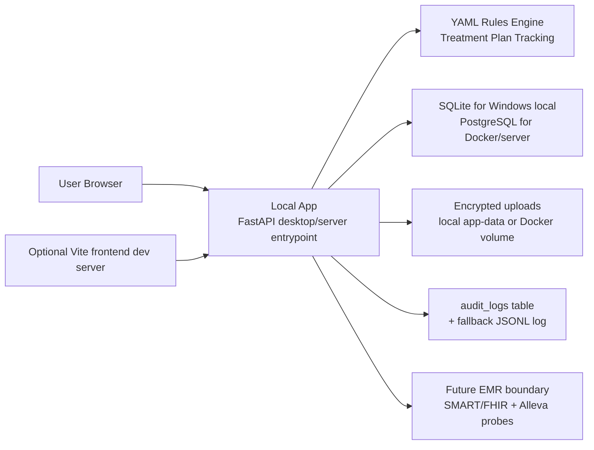

# IZ Clinical Notes Analyzer

IZ Clinical Notes Analyzer is a local-first clinical chart-review application for checking clinical note binders, Treatment Plan Tracking completeness, office-manager review workflow, role-based access control, and audit logging.

The current Windows direction is intentionally simple for clinic users:

- runs on ordinary Windows 10 and Windows 11 machines
- does not require Docker for the local desktop workflow
- does not require PostgreSQL for the local desktop workflow
- uses SQLite for local desktop data
- stores runtime data under the user's local Windows app-data folder
- provides a double-click Windows launcher
- provides PowerShell scripts for full-stack testing and Alleva API connectivity checks
- keeps deterministic Treatment Plan Tracking completeness rules in YAML configuration

## What this app does

- Accepts clinical note binder uploads grouped by `patient_id`.
- Auto-detects `patient_id` from uploaded files when possible.
- Creates an immutable versioned note set for every upload/update.
- Generates automated review output from uploaded binder contents.
- Runs deterministic completeness checks from external YAML rules.
- Lets reviewers confirm, reject, or mark checklist items as not applicable.
- Supports office-manager approval or return-to-counselor workflow.
- Keeps audit logs for reads, writes, auth, downloads, and workflow changes.
- Stores uploaded source files encrypted at rest with SHA-256 digests.
- Includes runtime readiness checks for the local database, storage, encryption, parser support, dependency support, and rules configuration.
- Provides EMR connector boundaries and Alleva API connectivity probes for future EMR integration work.

## Who should use which section

- Non-technical Windows users: start with [Windows Quick Start](#windows-quick-start).
- Windows developers/testers: use [Windows Developer and Test Workflow](#windows-developer-and-test-workflow).
- Alleva API testing: use [Alleva API Connectivity Test](#alleva-api-connectivity-test).
- Docker/server operators: use [Docker and VPS Runtime](#docker-and-vps-runtime).

## Windows Quick Start

This is the recommended local run path for ordinary Windows 10 and Windows 11 machines.

### 1. Get the application folder onto the Windows machine

Use one of these approaches:

- download or copy a release folder prepared for this app
- clone the repo with Git
- copy the repo folder from another machine

For a source checkout, keep the project in a normal local folder such as:

```text
C:\Users\<your-user>\local-apps\IZ_clinical-notes-analyzer
```

Avoid running the app directly from OneDrive, Dropbox, iCloud Drive, Google Drive, or a network share. The source code can be backed up elsewhere, but the live runtime database and uploads should stay in local app data.

### 2. Install Python only if running from source

A packaged end-user release should include its own runtime. A source checkout requires Python 3.11 or newer.

To check Python from PowerShell:

```powershell
python --version
```

Expected result:

```text
Python 3.11.x
```

or newer.

If Python is missing, install Python 3.11+ from python.org or the Microsoft Store, then reopen PowerShell and check again.

### 3. Double-click the launcher

From Windows File Explorer, open the project folder and double-click:

```text
scripts\Start-IZ-Clinical-Notes-Analyzer.cmd
```

That launcher runs:

```text
scripts\startup-windows-local.ps1
```

The launcher will:

1. create local runtime folders under `%LOCALAPPDATA%\IZ Clinical Notes Analyzer`
2. create a local `.env` file if one does not already exist
3. generate local secrets and a bootstrap admin password
4. create or reuse `backend\.venv`
5. install backend Python dependencies for a source checkout
6. run the Treatment Plan rules-engine test before launch
7. start the local FastAPI app on `http://localhost:8000`
8. open the browser unless started with `-NoBrowser`

### 4. Save the first sign-in credentials

On first launch, the startup window prints credentials similar to this:

```text
First sign-in credentials:
  Username: admin
  Password: <generated-password>
```

Save the password securely. It is also stored in:

```text
%LOCALAPPDATA%\IZ Clinical Notes Analyzer\.env
```

The default bootstrap username is:

```text
admin
```

### 5. Open the app

The local app URL is:

```text
http://localhost:8000
```

The API health endpoint is:

```text
http://localhost:8000/api/health
```

The readiness endpoint is:

```text
http://localhost:8000/api/readiness
```

## Windows Command-Line Startup

If double-clicking the `.cmd` launcher is blocked or you want to see more detail, use PowerShell.

Open PowerShell in the repo root and run:

```powershell
.\scripts\startup-windows-local.ps1
```

To start without opening a browser automatically:

```powershell
.\scripts\startup-windows-local.ps1 -NoBrowser
```

If PowerShell blocks script execution, run the script with a one-time bypass from the repo root:

```powershell
powershell.exe -NoProfile -ExecutionPolicy Bypass -File .\scripts\startup-windows-local.ps1
```

The double-click `.cmd` launcher already uses this one-time bypass for the app script. It does not permanently change the Windows execution policy.

## Windows Runtime Data Locations

The Windows local runtime uses the user's local app-data folder rather than the repo folder.

Default runtime root:

```text
%LOCALAPPDATA%\IZ Clinical Notes Analyzer
```

Important files and folders:

| Path | Purpose |
| --- | --- |
| `%LOCALAPPDATA%\IZ Clinical Notes Analyzer\.env` | Local runtime configuration, generated secrets, bootstrap admin password |
| `%LOCALAPPDATA%\IZ Clinical Notes Analyzer\clinical-notes-analyzer.sqlite3` | Local SQLite application database |
| `%LOCALAPPDATA%\IZ Clinical Notes Analyzer\uploads` | Encrypted uploaded clinical note files |
| `%LOCALAPPDATA%\IZ Clinical Notes Analyzer\logs` | Startup logs and fallback audit logs |
| `%LOCALAPPDATA%\IZ Clinical Notes Analyzer\api-connectivity-reports` | Optional Alleva connectivity JSON reports |

Test runs use a separate folder:

```text
%LOCALAPPDATA%\IZ Clinical Notes Analyzer Test
```

## Windows Developer and Test Workflow

Use this when you want to verify that all local app pieces work from a Windows source checkout.

Open PowerShell in the repo root:

```powershell
.\scripts\test-local-app-stack.ps1
```

The test script does the following:

1. creates `backend\.venv` if needed
2. installs backend dependencies from `backend\requirements.txt`
3. creates a temporary test `.env` under `%LOCALAPPDATA%\IZ Clinical Notes Analyzer Test`
4. configures SQLite for the test run
5. runs backend unit tests under `backend\tests`
6. starts a test server on `http://localhost:8000`
7. checks `/api/health`
8. checks `/api/readiness`
9. logs in as the generated test admin
10. calls `/api/users/me`
11. stops the test server

To use a different test port:

```powershell
.\scripts\test-local-app-stack.ps1 -Port 8010
```

To skip dependency installation after the environment is already prepared:

```powershell
.\scripts\test-local-app-stack.ps1 -SkipDependencyInstall
```

## Alleva API Connectivity Test

The app includes a dedicated connectivity probe for the Alleva API documentation and likely OpenAPI endpoints.

Run from PowerShell in the repo root:

```powershell
.\scripts\test-alleva-api-connectivity.ps1
```

To write a JSON report:

```powershell
.\scripts\test-alleva-api-connectivity.ps1 -WriteJsonReport
```

Default Swagger UI target:

```text
https://api.allevasoft.com/swagger/index.html
```

The script probes:

- Swagger UI
- `/swagger/v1/swagger.json`
- `/swagger.json`
- `/openapi.json`
- API root

If Alleva provides a different Swagger/OpenAPI URL:

```powershell
.\scripts\test-alleva-api-connectivity.ps1 -SwaggerUiUrl "https://api.allevasoft.com/swagger/index.html" -WriteJsonReport
```

If protected endpoints require credentials, set credentials as environment variables for the current PowerShell session. Do not write credentials into source files.

Bearer token example:

```powershell
$env:ALLEVA_API_BEARER_TOKEN = "paste-token-here"
.\scripts\test-alleva-api-connectivity.ps1 -WriteJsonReport
Remove-Item Env:\ALLEVA_API_BEARER_TOKEN
```

API key example:

```powershell
$env:ALLEVA_API_KEY = "paste-api-key-here"
.\scripts\test-alleva-api-connectivity.ps1 -WriteJsonReport
Remove-Item Env:\ALLEVA_API_KEY
```

Reports are written to:

```text
%LOCALAPPDATA%\IZ Clinical Notes Analyzer\api-connectivity-reports
```

Credential guardrails:

- do not commit Alleva credentials
- do not paste credentials into `.env.example`
- do not paste credentials into README files or YAML rules files
- do not paste PHI into API connectivity tests

## Running Backend Pieces Manually on Windows

Most users should use the launcher or the test script. These manual commands are useful for debugging.

### Create or reuse the backend virtual environment

```powershell
cd C:\path\to\IZ_clinical-notes-analyzer
python -m venv backend\.venv
.\backend\.venv\Scripts\python.exe -m pip install --upgrade pip
.\backend\.venv\Scripts\python.exe -m pip install -r backend\requirements.txt
```

### Run backend tests

```powershell
.\backend\.venv\Scripts\python.exe -m pytest backend\tests -q
```

### Run only the rules-engine tests

```powershell
.\backend\.venv\Scripts\python.exe -m pytest backend\tests\test_rules_engine.py -q
```

### Start the local API manually

The startup script normally sets the right environment file. Manual runs should either use the generated app-data `.env` or set the environment variable directly.

```powershell
$env:IZ_CNA_ENV_FILE = "$env:LOCALAPPDATA\IZ Clinical Notes Analyzer\.env"
$env:PYTHONPATH = "$PWD\backend"
.\backend\.venv\Scripts\python.exe -m uvicorn app.main:app --app-dir backend --host 127.0.0.1 --port 8000
```

Then open:

```text
http://localhost:8000
```

### Start the lean desktop app entrypoint

The repo also includes a lean desktop starter:

```powershell
.\scripts\start-desktop-local.ps1
```

or with a custom port:

```powershell
.\scripts\start-desktop-local.ps1 -Port 8010
```

This starts `app.desktop_main:app`. Use `startup-windows-local.ps1` for the fuller non-technical-user startup path because it creates the app-data `.env`, runs readiness-oriented checks, and opens the browser.

## Running Frontend Pieces Manually on Windows

The Windows local backend can serve built frontend assets if `frontend\dist` exists. During active frontend development, run Vite separately.

### Install frontend dependencies

```powershell
cd frontend
npm install
```

### Start the Vite dev server

```powershell
npm run dev
```

Default Vite URL:

```text
http://localhost:5173
```

If the backend is running on `http://localhost:8000`, make sure the frontend API proxy or frontend environment points API calls to the backend.

### Build production frontend assets

```powershell
cd frontend
npm run build
```

Expected build output:

```text
frontend\dist
```

After building, restart the Windows local backend. The desktop/backend entrypoint can serve the built assets from `frontend\dist` when configured by the app code.

## Treatment Plan Tracking Rules

The first deterministic completeness workflow is configured here:

```text
config\rules\alleva_treatment_plan_completeness_rules.yaml
```

The rules engine lives here:

```text
backend\app\services\rules_engine.py
```

The rules API boundary lives here:

```text
backend\app\api\rules_routes.py
```

The rules-engine unit tests live here:

```text
backend\tests\test_rules_engine.py
```

The Windows startup script validates the rules engine before launch by running the rules-engine test.

Rules-file guardrails:

- keep PHI out of YAML rules files
- keep vendor credentials out of YAML rules files
- treat YAML rules as deterministic business logic, not as LLM prompts
- add future workflows as versioned rules profiles under `config\rules`

## EMR API Readiness

The app is upload-first today. It has a standards-aligned EMR connector boundary for future EMR work.

Current EMR-related behavior:

- Admin settings can store EMR vendor label, FHIR base URL, SMART client ID/secret, scopes, and timeout.
- `GET /api/emr/profile` reports configured SMART/FHIR profile information.
- `POST /api/emr/discover` validates SMART `.well-known/smart-configuration` discovery when a real EMR FHIR base URL is available.
- `GET /api/emr/import-plan?patient_id=...` shows the planned FHIR R4 `Patient`, `DocumentReference`, `Binary`, and optional `Provenance` request flow.
- Alleva live API import remains gated until client/vendor credentials, tenant base URLs, attachment behavior, pagination/rate-limit rules, and official documentation are available.

The local connectivity script does not import patient data. It only checks reachability and OpenAPI/Swagger availability.

## Default Local URLs

Windows local desktop runtime:

| Purpose | URL |
| --- | --- |
| App | `http://localhost:8000` |
| API health | `http://localhost:8000/api/health` |
| Readiness | `http://localhost:8000/api/readiness` |
| Backend API base | `http://localhost:8000/api` |

Frontend dev mode, when run separately:

| Purpose | URL |
| --- | --- |
| Vite frontend | `http://localhost:5173` |
| Backend API | `http://localhost:8000/api` |

Docker/server mode defaults may expose frontend and backend separately:

| Purpose | URL |
| --- | --- |
| Docker frontend | `http://localhost:5173` |
| Docker backend | `http://localhost:8000` |
| Docker backend through frontend proxy | `http://localhost:5173/api` |

## Local Configuration

The generated Windows local `.env` is stored outside the repo:

```text
%LOCALAPPDATA%\IZ Clinical Notes Analyzer\.env
```

Important local settings:

| Variable | Purpose | Windows local default |
| --- | --- | --- |
| `ENVIRONMENT` | Runtime label | `local-client` |
| `BACKEND_PORT` | Local backend port | `8000` |
| `DATABASE_BACKEND` | Local DB engine | `sqlite` |
| `LOCAL_SQLITE_DB_PATH` | SQLite database file | `clinical-notes-analyzer.sqlite3` |
| `SECRET_KEY` | JWT signing secret | generated on first startup |
| `DATA_ENCRYPTION_KEY` | upload encryption key | generated on first startup |
| `FRONTEND_ORIGIN` | local app origin | `http://localhost:8000` |
| `FRONTEND_ORIGINS` | allowed local origins | `http://localhost:8000,http://localhost:5173` |
| `ALLOWED_HOSTS` | accepted host headers | `localhost,127.0.0.1,::1,testserver` |
| `UPLOAD_DIR` | encrypted upload location | `uploads` under app-data root |
| `LOG_DIR` | log location | `logs` under app-data root |
| `RULES_CONFIG_PATH` | Treatment Plan rules file | repo `config\rules\alleva_treatment_plan_completeness_rules.yaml` |
| `BOOTSTRAP_ADMIN_USERNAME` | bootstrap admin username | `admin` |
| `BOOTSTRAP_ADMIN_PASSWORD` | bootstrap admin password | generated on first startup |
| `RESET_BOOTSTRAP_ADMIN_ON_STARTUP` | reset bootstrap admin from `.env` on startup | `true` |
| `LLM_ENABLED` | optional LLM support | `false` |
| `EMR_API_ENABLED` | live EMR API support | `false` |

## User Roles

- `admin`
  - full access
  - can manage users, settings, logs, charts, uploads, and rules/API configuration
- `manager`
  - can review charts and patient note sets
  - can approve or return charts
- `counselor`
  - can upload note sets
  - can view only their own charts and uploads

## Basic User Workflow

### Counselor or uploader

1. Sign in.
2. Open upload/review intake area.
3. Enter `patient_id`, or leave it blank and let the app try to detect it from files.
4. Add clinical note files and metadata.
5. Submit the upload.
6. The app stores the binder, extracts readable text, and creates automated review output.

### Reviewer or manager

1. Open the review queue.
2. Select the patient chart.
3. Read the system summary and checklist results.
4. Confirm or correct checklist items.
5. Approve the chart or return it with a comment.

### Administrator

Admins can also:

- create and manage users
- unlock users or require password reset
- review forensic logs
- update app settings
- review system readiness
- test future EMR connector settings

## File Rules

Supported file extensions:

- `.csv`
- `.doc`
- `.docx`
- `.jpeg`
- `.jpg`
- `.pdf`
- `.png`
- `.rtf`
- `.txt`
- `.zip`

Limits:

- per-file limit: `50MB`
- total binder upload limit: `250MB`
- maximum files per binder upload: `40`

Notes:

- `.doc` files are stored securely; reliable text extraction may require conversion to `.docx`, `.pdf`, or `.txt` first.
- Patient ID auto-detection scans filenames and readable file contents.
- New uploads are encrypted before being written to disk.
- Downloads are decrypted only after authentication and authorization checks pass.

## Troubleshooting Windows Local Runs

### The double-click launcher opens and closes too quickly

Run it from PowerShell so the error stays visible:

```powershell
powershell.exe -NoProfile -ExecutionPolicy Bypass -File .\scripts\startup-windows-local.ps1
```

Also check startup logs:

```text
%LOCALAPPDATA%\IZ Clinical Notes Analyzer\logs
```

### Python is not found

For source checkout runs, install Python 3.11+ and reopen PowerShell.

Check:

```powershell
python --version
```

A packaged release should include a bundled runtime and should not require the user to install Python.

### Port 8000 is already in use

Find the process using port 8000:

```powershell
netstat -ano | findstr :8000
```

Then either stop the conflicting app or run a lean desktop start on another port:

```powershell
.\scripts\start-desktop-local.ps1 -Port 8010
```

The fuller startup script currently uses port `8000` from the generated local `.env`.

### Login fails

Check the generated bootstrap credentials in:

```text
%LOCALAPPDATA%\IZ Clinical Notes Analyzer\.env
```

Look for:

```text
BOOTSTRAP_ADMIN_USERNAME=admin
BOOTSTRAP_ADMIN_PASSWORD=...
```

If `RESET_BOOTSTRAP_ADMIN_ON_STARTUP=true`, restarting the app resets the bootstrap admin from the `.env` values.

### Readiness fails

Open:

```text
http://localhost:8000/api/readiness
```

Also inspect:

```text
%LOCALAPPDATA%\IZ Clinical Notes Analyzer\logs
```

Common causes:

- missing Python dependencies
- invalid YAML rules file
- local app-data folder not writable
- encryption key missing or malformed
- SQLite database path not writable
- running from a cloud-synced folder that interferes with runtime file access

### Upload fails

Check for:

- unsupported file extension
- file larger than `50MB`
- total upload larger than `250MB`
- missing `patient_id` with no successful auto-detection
- conflicting detected patient IDs across uploaded files
- upload folder not writable

### Alleva connectivity test fails

Run with a JSON report:

```powershell
.\scripts\test-alleva-api-connectivity.ps1 -WriteJsonReport
```

Then review the report under:

```text
%LOCALAPPDATA%\IZ Clinical Notes Analyzer\api-connectivity-reports
```

Likely causes:

- network or DNS issue
- Alleva Swagger/OpenAPI URL changed
- endpoint requires authentication
- credentials were not set in environment variables
- proxy or security software blocked the request

## Docker and VPS Runtime

Docker Compose remains available for developer/server scenarios. It is not the recommended ordinary Windows desktop-user path.

Docker runtime services:

| Service | Purpose | Default exposed port |
| --- | --- | --- |
| `frontend` | React app served through nginx and proxying `/api/*` to backend | `127.0.0.1:5173` |
| `backend` | FastAPI API, auth, workflow, uploads, audit logging, schema bootstrap | `127.0.0.1:8000` |
| `postgres` | Dedicated application-owned PostgreSQL database | `127.0.0.1:5432` |

### Full Docker stack

```bash
cp .env.example .env
docker compose up -d --build
./scripts/smoke.sh
```

### Useful Docker commands

```bash
docker compose ps
docker compose logs --tail=200
docker compose logs --tail=200 backend
docker compose logs --tail=200 frontend
docker compose logs --tail=200 postgres
docker compose down
```

### Destructive Docker reset

This deletes the PostgreSQL Docker volume and all database contents:

```bash
docker compose down -v
```

## Architecture



## Key Repository Files

| File | Purpose |
| --- | --- |
| `scripts\Start-IZ-Clinical-Notes-Analyzer.cmd` | Double-click Windows launcher |
| `scripts\startup-windows-local.ps1` | Main Windows local startup script |
| `scripts\start-desktop-local.ps1` | Lean desktop runtime starter |
| `scripts\test-local-app-stack.ps1` | Full local Windows smoke test |
| `scripts\test-alleva-api-connectivity.ps1` | Alleva Swagger/OpenAPI/API reachability probe |
| `backend\app\main.py` | Main FastAPI application |
| `backend\app\desktop_main.py` | Desktop runtime app entrypoint |
| `backend\app\services\runtime_checks.py` | Runtime readiness checks |
| `backend\app\services\rules_engine.py` | Deterministic YAML rules engine |
| `backend\app\api\rules_routes.py` | Rules API boundary |
| `backend\tests\test_rules_engine.py` | Rules-engine tests |
| `config\rules\alleva_treatment_plan_completeness_rules.yaml` | Treatment Plan Tracking completeness rules |
| `docs\windows-local-refactor.md` | Windows local refactor notes |
| `frontend\src` | React frontend source |
| `frontend\dist` | Built frontend assets after `npm run build` |

## Backup and Restore Notes

For Windows local desktop runs, back up both the SQLite database and encrypted upload files.

Minimum Windows local backup set:

```text
%LOCALAPPDATA%\IZ Clinical Notes Analyzer\.env
%LOCALAPPDATA%\IZ Clinical Notes Analyzer\clinical-notes-analyzer.sqlite3
%LOCALAPPDATA%\IZ Clinical Notes Analyzer\uploads
%LOCALAPPDATA%\IZ Clinical Notes Analyzer\logs
```

Important: the `.env` contains the encryption key needed to read encrypted uploaded files. Losing the `.env` may make encrypted uploads unrecoverable.

For Docker/PostgreSQL runs, back up the PostgreSQL database and the backend data volume separately.

PostgreSQL backup example:

```bash
pg_dump -Fc iz_clinical_notes_analyzer > backup.dump
```

PostgreSQL restore example:

```bash
pg_restore -d iz_clinical_notes_analyzer backup.dump
```

## Security and Privacy Guardrails

- Do not commit `.env` files.
- Do not commit SQLite runtime databases.
- Do not commit uploaded clinical documents.
- Do not commit Alleva credentials, API keys, or bearer tokens.
- Do not put PHI in YAML rules files.
- Keep runtime data out of cloud-synced folders when possible.
- Treat the local `.env` as sensitive because it contains secrets and the upload encryption key.
- Keep deterministic completeness scoring separate from optional LLM analysis.

## Current Status

The app now has a Windows local runtime path designed around SQLite, local app-data storage, deterministic YAML rules, startup/readiness checks, and a double-click launcher. Docker/PostgreSQL remains available for developer and server scenarios, but it is not required for the ordinary Windows 10/11 local desktop workflow.
